# Task-ADF-01: Azure Data Factory Foundation Setup

## Overview
This task covers the creation of essential Azure services for data integration: Azure Data Lake Storage Gen2, Azure Data Factory, and Azure SQL Database using the Azure portal.

## Prerequisites
- Active Azure subscription
- Contributor or Owner role in the subscription
- Basic understanding of Azure services

## Task Objectives
1. Create Azure Data Lake Storage Gen2 account
2. Create Azure Data Factory instance
3. Create Azure SQL Database and server
4. Verify connectivity between services

---

## Step 1: Create Azure Data Lake Storage Gen2

### 1.1 Navigate to Storage Account Creation

1. Sign in to [Azure Portal](https://portal.azure.com)
2. Click **"Create a resource"**
3. Search for **"Storage account"**
4. Click **"Create"**


### 1.2 Configure Basic Settings
- **Subscription**: Select your subscription
- **Resource Group**: Create new `sa1_test_eic_SudarshanDarade`
- **Storage Account Name**:`adlsvinoworld1000` (must be globally unique)
- **Region**: `South East Asia`
- **Performance**: `Standard`
- **Redundancy**: `Locally-redundant storage (LRS)`

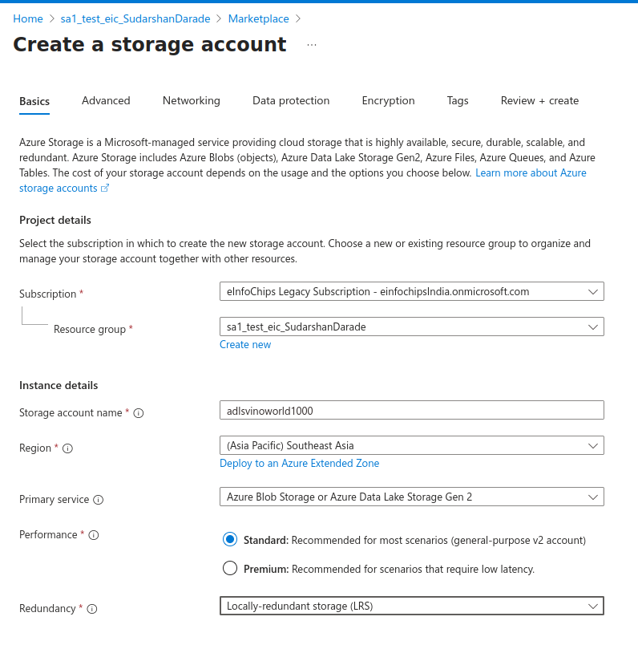

### 1.3 Configure Advanced Settings
- **Require secure transfer**: `Enabled`
- **Allow Blob public access**: `Disabled`
- **Minimum TLS version**: `Version 1.2`
- **Hierarchical namespace**: `Enabled` (This enables Data Lake Gen2)

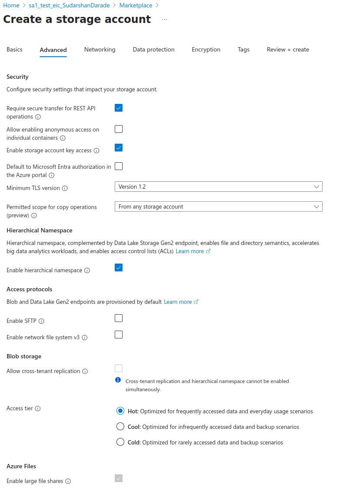

### 1.4 Complete Creation
1. Click **"Review + create"**
2. Click **"Create"**
3. Wait for deployment completion

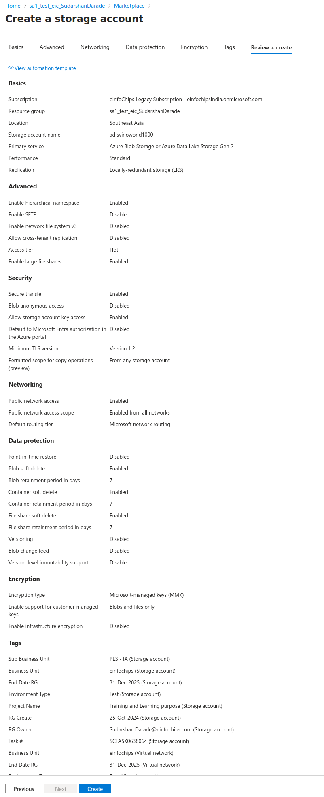
---

## Step 2: Create Azure Data Factory

### 2.1 Navigate to Data Factory Creation
1. In Azure Portal, click **"Create a resource"**
2. Search for **"Data Factory"**
3. Click **"Create"**

### 2.2 Configure Basic Settings
- **Subscription**: Select your subscription
- **Resource Group**: `sa1_test_eic_SudarshanDarade` (same as storage)
- **Region**: `South East Asia`
- **Name**: `vinoworld-dev-adf1000`
- **Version**: `V2`

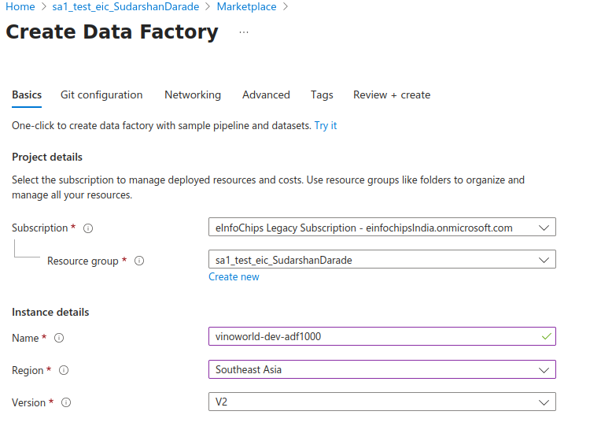

### 2.3 Configure Git Repository (Optional)
- **Configure Git later**: `Yes` (skip for now)

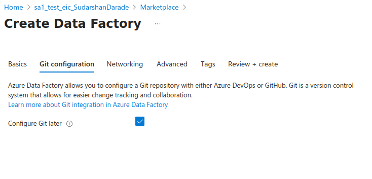

### 2.4 Complete Creation
1. Click **"Review + create"**
2. Click **"Create"**
3. Wait for deployment completion

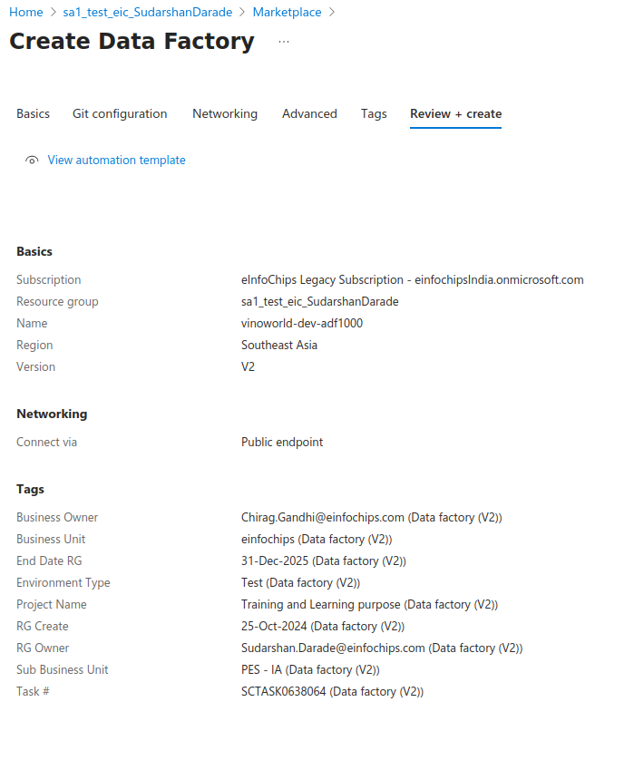
---

## Step 3: Create Azure SQL Database

### 3.1 Navigate to SQL Database Creation
1. In Azure Portal, click **"Create a resource"**
2. Search for **"SQL Database"**
3. Click **"Create"**

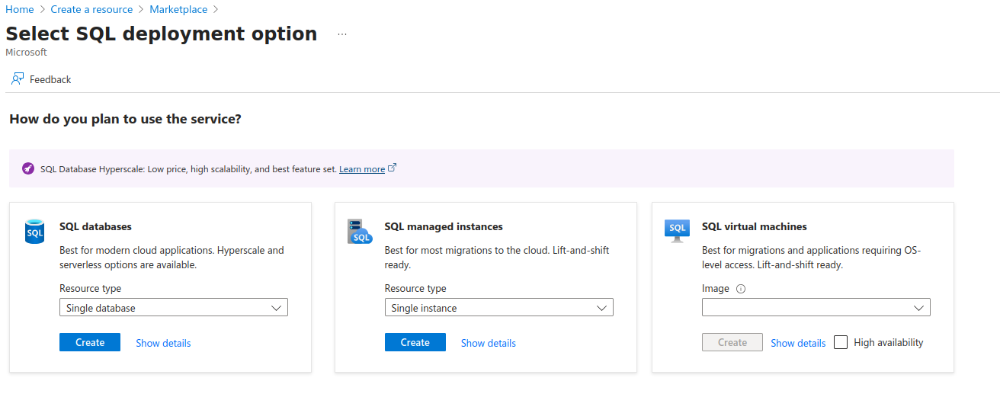

### 3.2 Configure Basic Settings
- **Subscription**: Select your subscription
- **Resource Group**: `sa1_test_eic_SudarshanDarade`
- **Database Name**: `vinoworld-dev-sqldb`

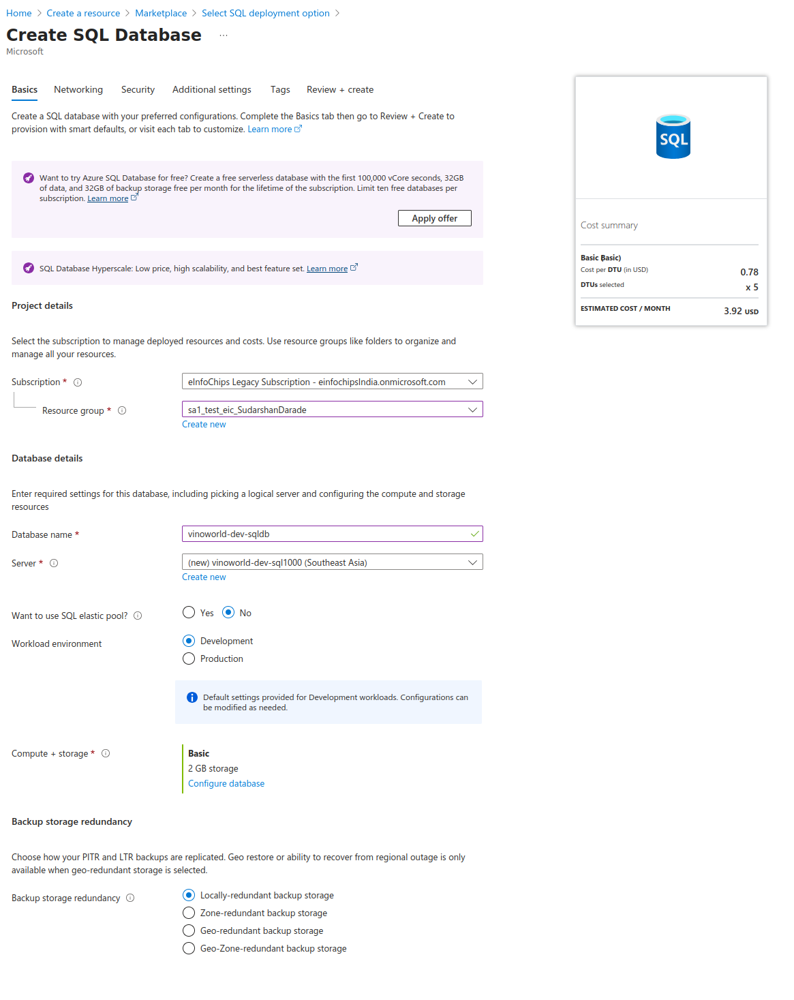

### 3.3 Configure Server Settings
1. Click **"Create new"** under Server
2. **Server Name**: `vinoworld-dev-sql1000` (must be globally unique)
3. **Location**: `South East Asia`
4. **Authentication method**: `Use SQL authentication`
5. **Server admin login**: `vinoworldadmin`
6. **Password**: Create a strong password (save it securely)
7. Click **"OK"**

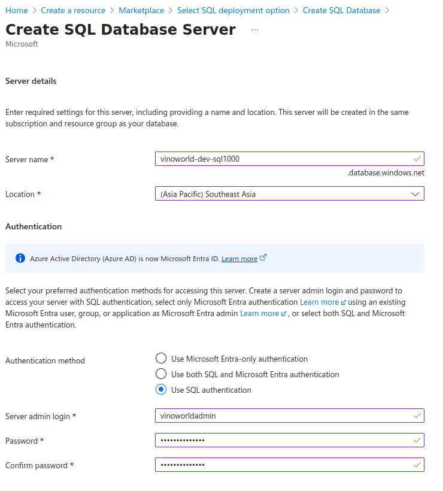

### 3.4 Configure Database Settings
- **Want to use SQL elastic pool**: `No`
- **Compute + storage**: Click **"Configure database"**
  - **Service tier**: `Basic`
  - **Data max size**: `2 GB`
  - Click **"Apply"**


### 3.5 Configure Networking
1. Go to **"Networking"** tab
2. **Connectivity method**: `Public endpoint`
3. **Allow Azure services**: `Yes`
4. **Add current client IP**: `Yes`

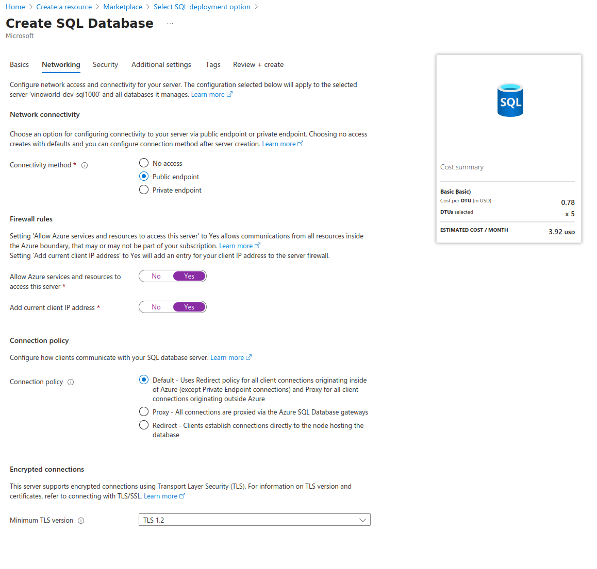

### 3.6 Complete Creation
1. Click **"Review + create"**
2. Click **"Create"**
3. Wait for deployment completion

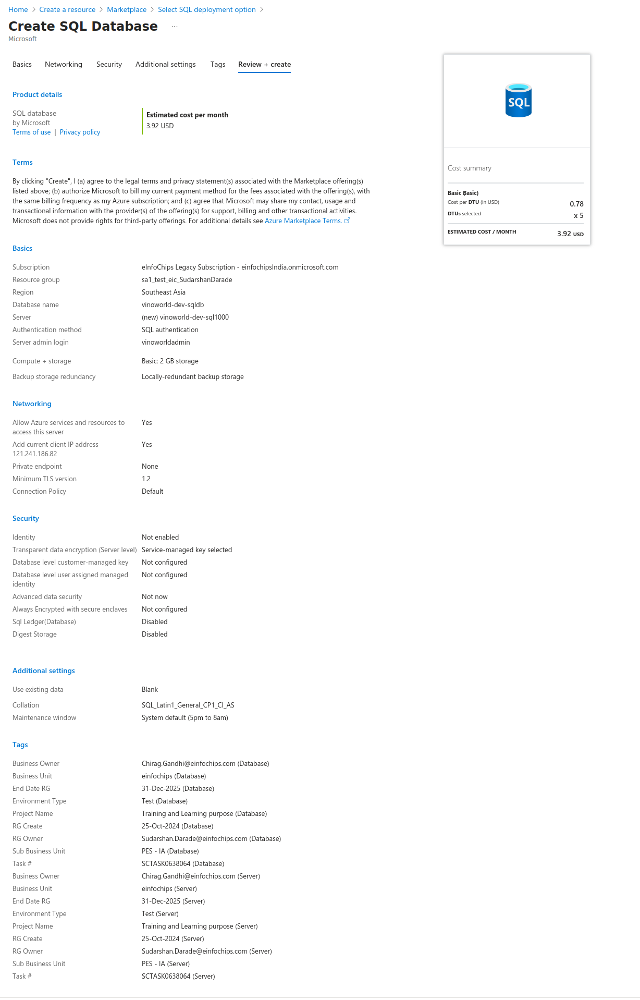

---


---

## Step 4: Verification and Testing

### 4.1 Verify Data Lake Storage
1. Navigate to your storage account
2. Check that hierarchical namespace is enabled
3. Verify containers are created
4. Test file upload to `raw-data` container

### 4.2 Verify Data Factory
1. Navigate to your Data Factory
2. Click **"Launch studio"**
3. Verify the Data Factory Studio opens successfully

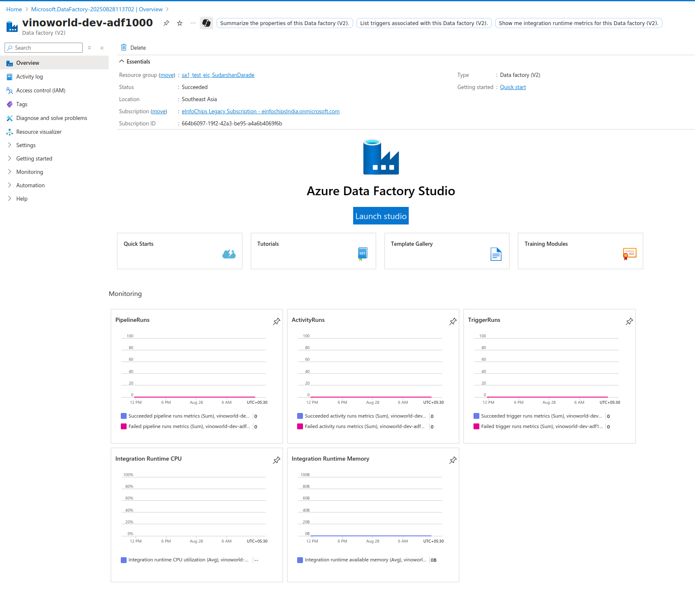

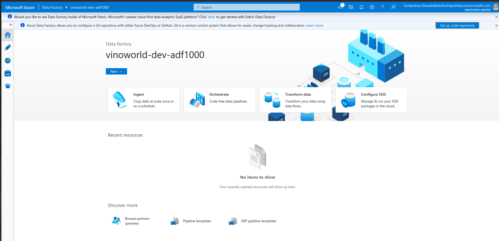

### 4.3 Verify SQL Database
1. Navigate to your SQL Database
2. Click **"Query editor"**
3. Login with `vinoworldadmin` credentials
4. Run test query: `SELECT @@VERSION`

### 4.4 Test Connectivity
1. In Data Factory Studio, go to **"Manage"** → **"Linked services"**
2. Create test connections to:
   - Azure Data Lake Storage Gen2
   - Azure SQL Database

---

## Step 5: Security Configuration

### 5.1 Configure Storage Account Access
1. Go to storage account → **"Access Control (IAM)"**
2. Add role assignment:
   - **Role**: `Storage Blob Data Contributor`
   - **Assign access to**: Data Factory managed identity

### 5.2 Configure SQL Database Firewall
1. Go to SQL Server → **"Networking"**
2. Verify Azure services access is enabled
3. Add Data Factory IP ranges if needed

---

## Expected Outcomes

After completing this task, you should have:

1. ✅ Azure Data Lake Storage Gen2 account with hierarchical namespace
2. ✅ Three containers: raw-data, processed-data, archive-data
3. ✅ Azure Data Factory V2 instance
4. ✅ Azure SQL Database with server
5. ✅ Proper networking and security configurations
6. ✅ Verified connectivity between all services

## Resource Summary

| Service | Name | Resource Group | Region |
|---------|------|----------------|---------|
| Storage Account | adlsvinoworld1000 | sa1_test_eic_SudarshanDarade | South East Asia |
| Data Factory | vinoworld-dev-adf1000 | sa1_test_eic_SudarshanDarade | South East Asia |
| SQL Server | vinoworld-dev-sql1000 | sa1_test_eic_SudarshanDarade | South East Asia |
| SQL Database | vinoworld-dev-sqldb | sa1_test_eic_SudarshanDarade | South East Asia |

## Next Steps

- **Task-ADF-02**: Create data pipelines and linked services
- **Task-ADF-03**: Implement data transformation workflows

## Troubleshooting

### Common Issues
1. **Storage account name not available**: Try different unique name
2. **SQL server name not available**: Try different unique name
3. **Connectivity issues**: Check firewall rules and network settings
4. **Permission errors**: Verify role assignments and access policies

### Cleanup Commands
```bash
# Delete resource group (removes all resources)
az group delete --name sa1_test_eic_SudarshanDarade --yes --no-wait
```

---

**Completion Time**: ~30-45 minutes  
**Difficulty Level**: Beginner  
**Cost Impact**: Low (Basic tiers selected)