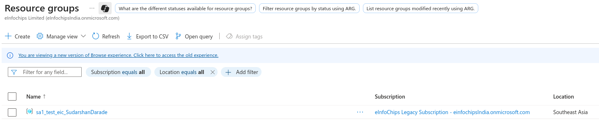
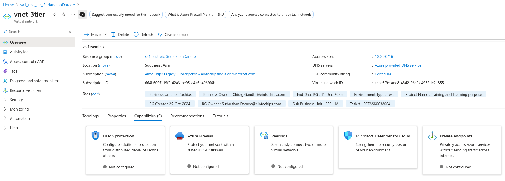
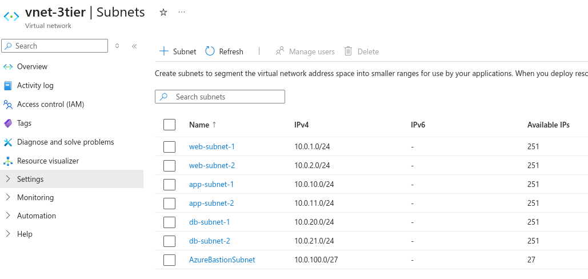

# Creating a 3-Tier Virtual Network Architecture on Azure

This guide outlines the steps to create a secure 3-tier virtual network architecture on Microsoft Azure with proper subnet segmentation and connectivity.

## Architecture Overview

The 3-tier architecture includes:
- **Web Tier**: 2 Public subnets for load balancers and web servers
- **Application Tier**: 2 Private subnets for application servers
- **Database Tier**: 2 Database subnets for database servers
- **Management Tier**: 1 Bastion subnet for secure administrative access

## Prerequisites

- An active Microsoft Azure account
- Basic understanding of networking concepts
- Azure CLI or Azure Portal access

---

## Network Design

### IP Address Planning

| Tier | Subnet Name | CIDR Block | Purpose |
|------|-------------|------------|---------|
| Web | web-subnet-1 | 10.0.1.0/24 | Public web servers (AZ-1) |
| Web | web-subnet-2 | 10.0.2.0/24 | Public web servers (AZ-2) |
| App | app-subnet-1 | 10.0.10.0/24 | Private app servers (AZ-1) |
| App | app-subnet-2 | 10.0.11.0/24 | Private app servers (AZ-2) |
| DB | db-subnet-1 | 10.0.20.0/24 | Database servers (AZ-1) |
| DB | db-subnet-2 | 10.0.21.0/24 | Database servers (AZ-2) |
| Management | bastion-subnet | 10.0.100.0/27 | Azure Bastion |

---

## Steps

### 1. Create Resource Group

```bash
az group create \
  --name sa1_test_eic_SudarshanDarade \
  --location southeastasia
```


### 2. Create Virtual Network

```bash
az network vnet create \
  --resource-group sa1_test_eic_SudarshanDarade \
  --name vnet-3tier \
  --address-prefix 10.0.0.0/16 \
  --location southeastasia
```


### 3. Create Subnets

#### Web Tier Subnets (Public)

```bash
# Web Subnet 1
az network vnet subnet create \
  --resource-group sa1_test_eic_SudarshanDarade \
  --vnet-name vnet-3tier \
  --name web-subnet-1 \
  --address-prefix 10.0.1.0/24

# Web Subnet 2
az network vnet subnet create \
  --resource-group sa1_test_eic_SudarshanDarade \
  --vnet-name vnet-3tier \
  --name web-subnet-2 \
  --address-prefix 10.0.2.0/24
```

#### Application Tier Subnets (Private)

```bash
# App Subnet 1
az network vnet subnet create \
  --resource-group sa1_test_eic_SudarshanDarade \
  --vnet-name vnet-3tier \
  --name app-subnet-1 \
  --address-prefix 10.0.10.0/24

# App Subnet 2
az network vnet subnet create \
  --resource-group sa1_test_eic_SudarshanDarade \
  --vnet-name vnet-3tier \
  --name app-subnet-2 \
  --address-prefix 10.0.11.0/24
```

#### Database Tier Subnets

```bash
# DB Subnet 1
az network vnet subnet create \
  --resource-group sa1_test_eic_SudarshanDarade \
  --vnet-name vnet-3tier \
  --name db-subnet-1 \
  --address-prefix 10.0.20.0/24

# DB Subnet 2
az network vnet subnet create \
  --resource-group sa1_test_eic_SudarshanDarade \
  --vnet-name vnet-3tier \
  --name db-subnet-2 \
  --address-prefix 10.0.21.0/24
```

#### Bastion Subnet

```bash
# Bastion Subnet (must be named AzureBastionSubnet)
az network vnet subnet create \
  --resource-group sa1_test_eic_SudarshanDarade \
  --vnet-name vnet-3tier \
  --name AzureBastionSubnet \
  --address-prefix 10.0.100.0/27
```


### 4. Create Network Security Groups (NSGs)

#### Web Tier NSG

```bash
az network nsg create \
  --resource-group sa1_test_eic_SudarshanDarade \
  --name nsg-web-tier

# Allow HTTP traffic
az network nsg rule create \
  --resource-group sa1_test_eic_SudarshanDarade \
  --nsg-name nsg-web-tier \
  --name allow-http \
  --priority 100 \
  --source-address-prefixes '*' \
  --destination-port-ranges 80 \
  --access Allow \
  --protocol Tcp

# Allow HTTPS traffic
az network nsg rule create \
  --resource-group sa1_test_eic_SudarshanDarade \
  --nsg-name nsg-web-tier \
  --name allow-https \
  --priority 110 \
  --source-address-prefixes '*' \
  --destination-port-ranges 443 \
  --access Allow \
  --protocol Tcp

# Allow SSH from Bastion subnet
az network nsg rule create \
  --resource-group sa1_test_eic_SudarshanDarade \
  --nsg-name nsg-web-tier \
  --name allow-ssh-bastion \
  --priority 120 \
  --source-address-prefixes 10.0.100.0/27 \
  --destination-port-ranges 22 \
  --access Allow \
  --protocol Tcp
```

#### Application Tier NSG

```bash
az network nsg create \
  --resource-group sa1_test_eic_SudarshanDarade \
  --name nsg-app-tier

# Allow traffic from web tier
az network nsg rule create \
  --resource-group sa1_test_eic_SudarshanDarade \
  --nsg-name nsg-app-tier \
  --name allow-web-tier \
  --priority 100 \
  --source-address-prefixes 10.0.1.0/24 10.0.2.0/24 \
  --destination-port-ranges 8080 \
  --access Allow \
  --protocol Tcp

# Allow SSH from Bastion subnet
az network nsg rule create \
  --resource-group sa1_test_eic_SudarshanDarade \
  --nsg-name nsg-app-tier \
  --name allow-ssh-bastion \
  --priority 110 \
  --source-address-prefixes 10.0.100.0/27 \
  --destination-port-ranges 22 \
  --access Allow \
  --protocol Tcp
```

#### Database Tier NSG

```bash
az network nsg create \
  --resource-group sa1_test_eic_SudarshanDarade \
  --name nsg-db-tier

# Allow MySQL/PostgreSQL from app tier
az network nsg rule create \
  --resource-group sa1_test_eic_SudarshanDarade \
  --nsg-name nsg-db-tier \
  --name allow-db-app-tier \
  --priority 100 \
  --source-address-prefixes 10.0.10.0/24 10.0.11.0/24 \
  --destination-port-ranges 3306 5432 \
  --access Allow \
  --protocol Tcp

# Allow SSH from Bastion subnet
az network nsg rule create \
  --resource-group sa1_test_eic_SudarshanDarade \
  --nsg-name nsg-db-tier \
  --name allow-ssh-bastion \
  --priority 110 \
  --source-address-prefixes 10.0.100.0/27 \
  --destination-port-ranges 22 \
  --access Allow \
  --protocol Tcp
```

### 5. Associate NSGs with Subnets

```bash
# Associate Web NSG
az network vnet subnet update \
  --resource-group sa1_test_eic_SudarshanDarade \
  --vnet-name vnet-3tier \
  --name web-subnet-1 \
  --network-security-group nsg-web-tier

az network vnet subnet update \
  --resource-group sa1_test_eic_SudarshanDarade \
  --vnet-name vnet-3tier \
  --name web-subnet-2 \
  --network-security-group nsg-web-tier

# Associate App NSG
az network vnet subnet update \
  --resource-group sa1_test_eic_SudarshanDarade \
  --vnet-name vnet-3tier \
  --name app-subnet-1 \
  --network-security-group nsg-app-tier

az network vnet subnet update \
  --resource-group sa1_test_eic_SudarshanDarade \
  --vnet-name vnet-3tier \
  --name app-subnet-2 \
  --network-security-group nsg-app-tier

# Associate DB NSG
az network vnet subnet update \
  --resource-group sa1_test_eic_SudarshanDarade \
  --vnet-name vnet-3tier \
  --name db-subnet-1 \
  --network-security-group nsg-db-tier

az network vnet subnet update \
  --resource-group sa1_test_eic_SudarshanDarade \
  --vnet-name vnet-3tier \
  --name db-subnet-2 \
  --network-security-group nsg-db-tier
```


### 6. Create NAT Gateway for Private Subnets

```bash
# Create Public IP for NAT Gateway
az network public-ip create \
  --resource-group sa1_test_eic_SudarshanDarade \
  --name pip-nat-gateway \
  --sku Standard \
  --allocation-method Static

# Create NAT Gateway
az network nat gateway create \
  --resource-group sa1_test_eic_SudarshanDarade \
  --name nat-gateway-3tier \
  --public-ip-addresses pip-nat-gateway \
  --idle-timeout 10

# Associate NAT Gateway with private subnets
az network vnet subnet update \
  --resource-group sa1_test_eic_SudarshanDarade \
  --vnet-name vnet-3tier \
  --name app-subnet-1 \
  --nat-gateway nat-gateway-3tier

az network vnet subnet update \
  --resource-group sa1_test_eic_SudarshanDarade \
  --vnet-name vnet-3tier \
  --name app-subnet-2 \
  --nat-gateway nat-gateway-3tier

az network vnet subnet update \
  --resource-group sa1_test_eic_SudarshanDarade \
  --vnet-name vnet-3tier \
  --name db-subnet-1 \
  --nat-gateway nat-gateway-3tier

az network vnet subnet update \
  --resource-group sa1_test_eic_SudarshanDarade \
  --vnet-name vnet-3tier \
  --name db-subnet-2 \
  --nat-gateway nat-gateway-3tier
```


### 7. Create Azure Bastion

```bash
# Create Public IP for Bastion
az network public-ip create \
  --resource-group sa1_test_eic_SudarshanDarade \
  --name pip-bastion \
  --sku Standard \
  --allocation-method Static

# Create Bastion Host
az network bastion create \
  --resource-group sa1_test_eic_SudarshanDarade \
  --name bastion-3tier \
  --public-ip-address pip-bastion \
  --vnet-name vnet-3tier \
  --location southeastasia
```

### 8. Create Route Tables (Optional)

```bash
# Create route table for app tier
az network route-table create \
  --resource-group sa1_test_eic_SudarshanDarade \
  --name rt-app-tier

# Create custom route to force traffic through firewall (if needed)
az network route-table route create \
  --resource-group sa1_test_eic_SudarshanDarade \
  --route-table-name rt-app-tier \
  --name route-to-internet \
  --address-prefix 0.0.0.0/0 \
  --next-hop-type VirtualAppliance \
  --next-hop-ip-address 10.0.100.4

# Associate route table with app subnets
az network vnet subnet update \
  --resource-group sa1_test_eic_SudarshanDarade \
  --vnet-name vnet-3tier \
  --name app-subnet-1 \
  --route-table rt-app-tier

az network vnet subnet update \
  --resource-group sa1_test_eic_SudarshanDarade \
  --vnet-name vnet-3tier \
  --name app-subnet-2 \
  --route-table rt-app-tier
```

---

## Connectivity Matrix

| Source | Destination | Protocol | Port | Access |
|--------|-------------|----------|------|--------|
| Internet | Web Tier | TCP | 80, 443 | ✅ Allow |
| Web Tier | App Tier | TCP | 8080 | ✅ Allow |
| App Tier | DB Tier | TCP | 3306, 5432 | ✅ Allow |
| Bastion | All Tiers | TCP | 22 | ✅ Allow |
| App Tier | Internet | TCP | 80, 443 | ✅ Allow (via NAT) |
| DB Tier | Internet | TCP | 80, 443 | ✅ Allow (via NAT) |
| Internet | App Tier | Any | Any | ❌ Deny |
| Internet | DB Tier | Any | Any | ❌ Deny |

---

## Verification

### Check Network Configuration

```bash
# List all subnets
az network vnet subnet list \
  --resource-group sa1_test_eic_SudarshanDarade \
  --vnet-name vnet-3tier \
  --output table

# Check NSG rules
az network nsg list \
  --resource-group sa1_test_eic_SudarshanDarade \
  --output table

# Verify Bastion deployment
az network bastion list \
  --resource-group sa1_test_eic_SudarshanDarade \
  --output table
```

### Test Connectivity

1. Deploy test VMs in each tier
2. Use Azure Bastion to connect to VMs
3. Test connectivity between tiers using telnet or nc commands
4. Verify internet access from private subnets through NAT Gateway

---

## Best Practices

1. **Security**: Use NSGs to implement least privilege access
2. **High Availability**: Deploy resources across multiple availability zones
3. **Monitoring**: Enable Network Watcher and flow logs
4. **Cost Optimization**: Use appropriate VM sizes and consider reserved instances
5. **Backup**: Implement backup strategies for critical data
6. **Documentation**: Maintain network diagrams and IP address management

---

## Cleanup

To remove all resources:


```bash
az group delete --name sa1_test_eic_SudarshanDarade --yes --no-wait
```