# Creating a Linux Virtual Machine on Azure

This guide outlines the steps to create a Linux virtual machine on Microsoft Azure using the Azure Portal.

## Prerequisites

- An active [Microsoft Azure account](https://portal.azure.com/)
- Basic understanding of Azure services
- SSH key pair (for authentication) or a password

---

## Steps

### 1. Generate SSH Key Pair

```bash
# Generate SSH key pair
ssh-keygen -t rsa -b 4096 -f ~/.ssh/azure-vm-key -N ""

# Display public key (copy this for VM creation)
cat ~/.ssh/azure-vm-key.pub
```
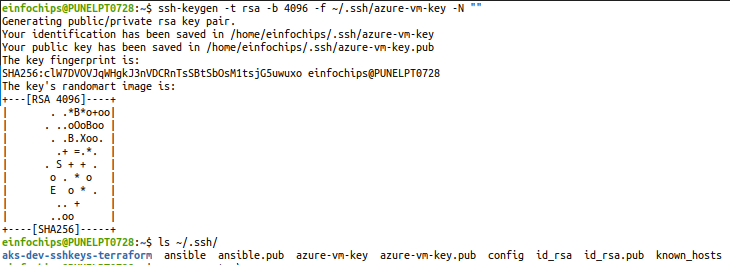

### 2. Sign in to the Azure Portal

- Go to [https://portal.azure.com](https://portal.azure.com)
- Log in with your Microsoft account

---

### 3. Create a Virtual Machine

1. In the left sidebar, click on **"Virtual machines"**
2. Click **"Create"** > **"Azure virtual machine"**

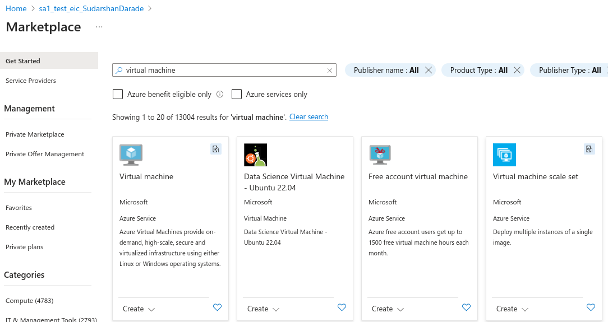
---

### 4. Configure Basic Settings

Fill in the following fields:

- **Subscription**: Choose your subscription
- **Resource Group**: Create a new one or select an existing group
- **Virtual machine name**: e.g., `linux-vm-01`
- **Region**: Select the region closest to you
- **Availability options**: Leave default unless high availability is required
- **Image**: Choose a Linux distro (e.g., Ubuntu 24.04 LTS)
- **Size**: Select the appropriate VM size (e.g., B2as for testing)

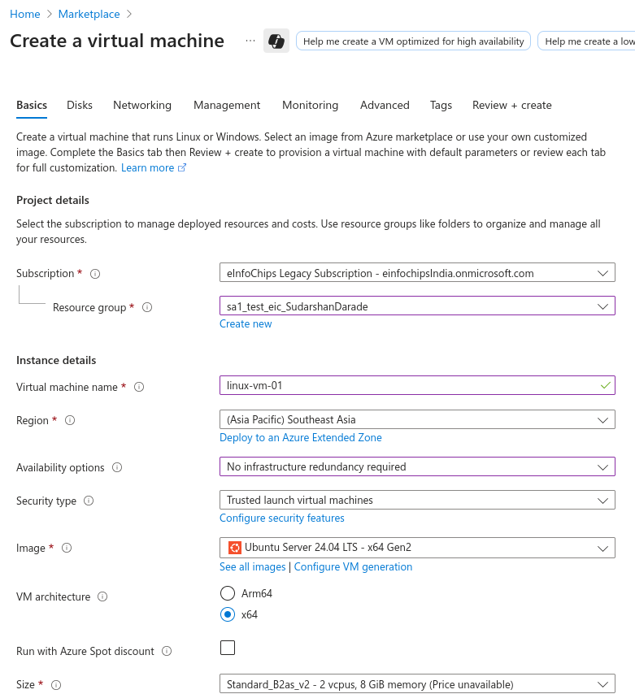

- **Authentication type**: Choose either `Username and password` or `SSH public key`
    - **SSH public key source**: Use existing public key
    - **SSH public key**: Paste the content from `~/.ssh/azure-vm-key.pub`
    - **Username**: `azureuser`

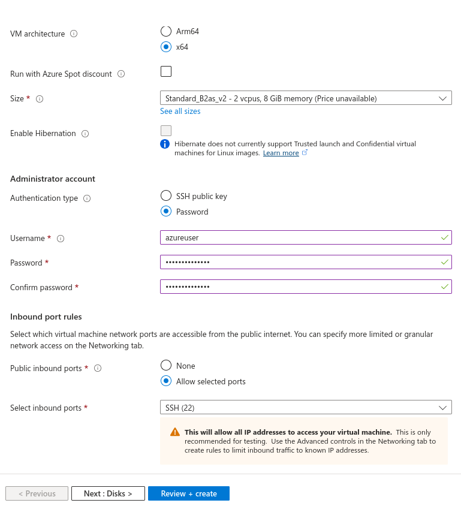
---

### 5. Disks

- Choose the OS disk type (SSD recommended)
- You can leave other disk options as default or add data disks if needed

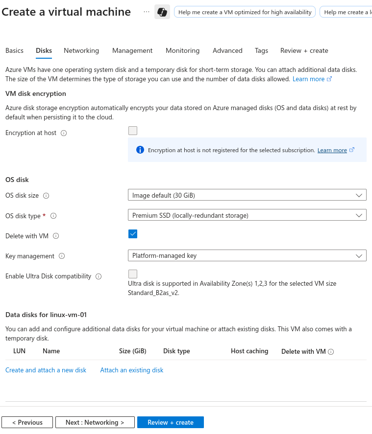
---

### 6. Networking

- **Virtual network**: Create new or use existing
- **Subnet**: Default or custom
- **Public IP**: Enabled (to allow SSH access)

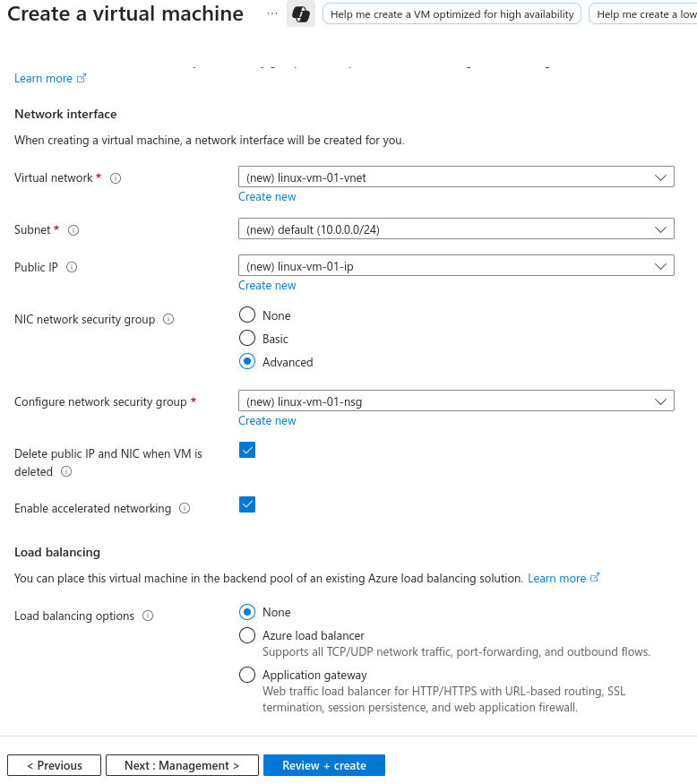

- **NIC network security group**: Allow SSH (port 22) for Linux

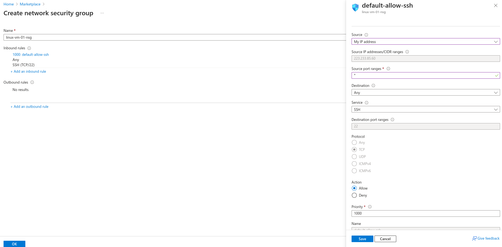
---

### 7. Management, Monitoring, and Advanced

- You can leave these sections with the default settings unless specific configuration is needed.

**Management :**

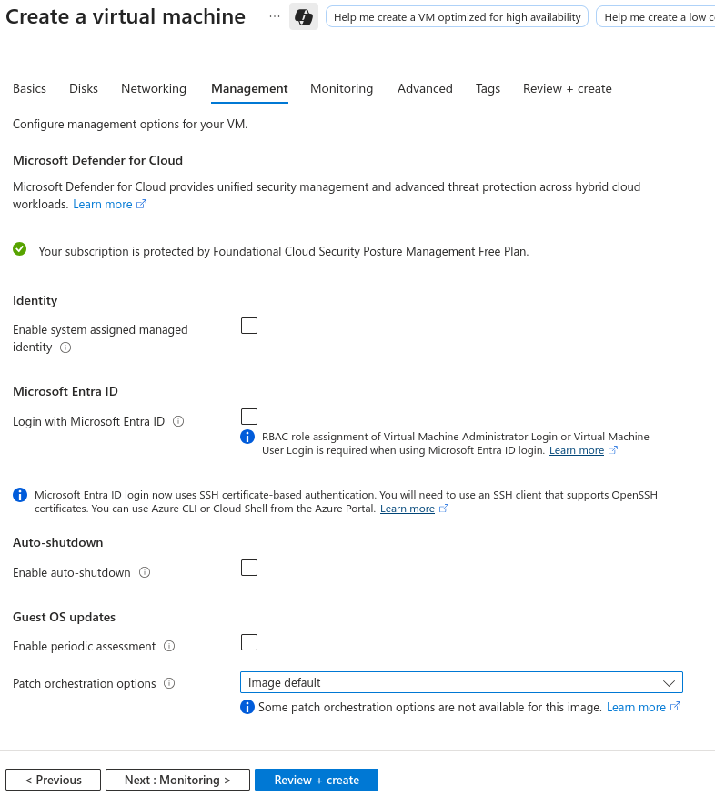

**Monitoring :**

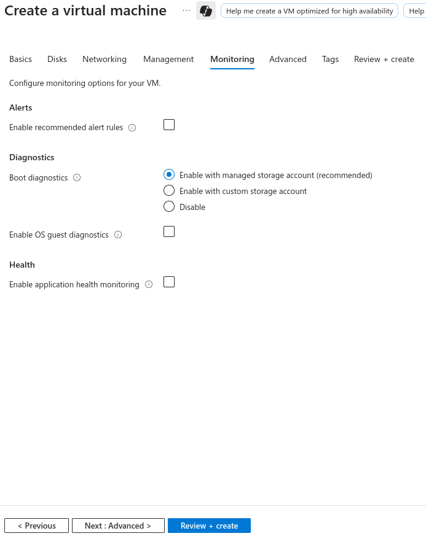

**Advanced :**

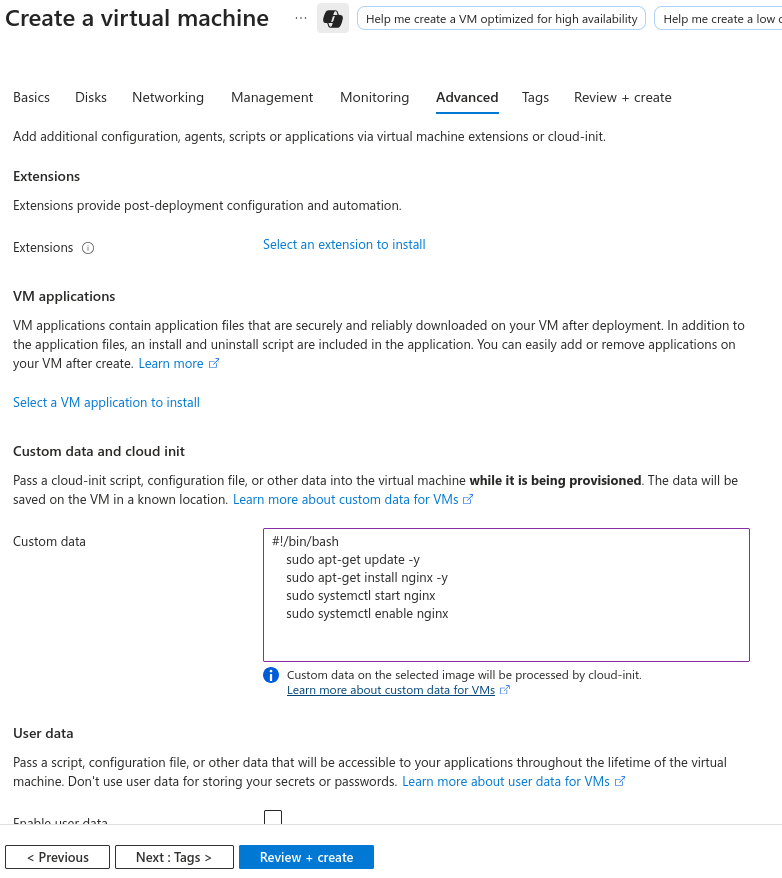
---

### 8. Review + Create

- Click **"Review + create"**
- Azure will validate the configuration
- Click **"Create"** to start deployment

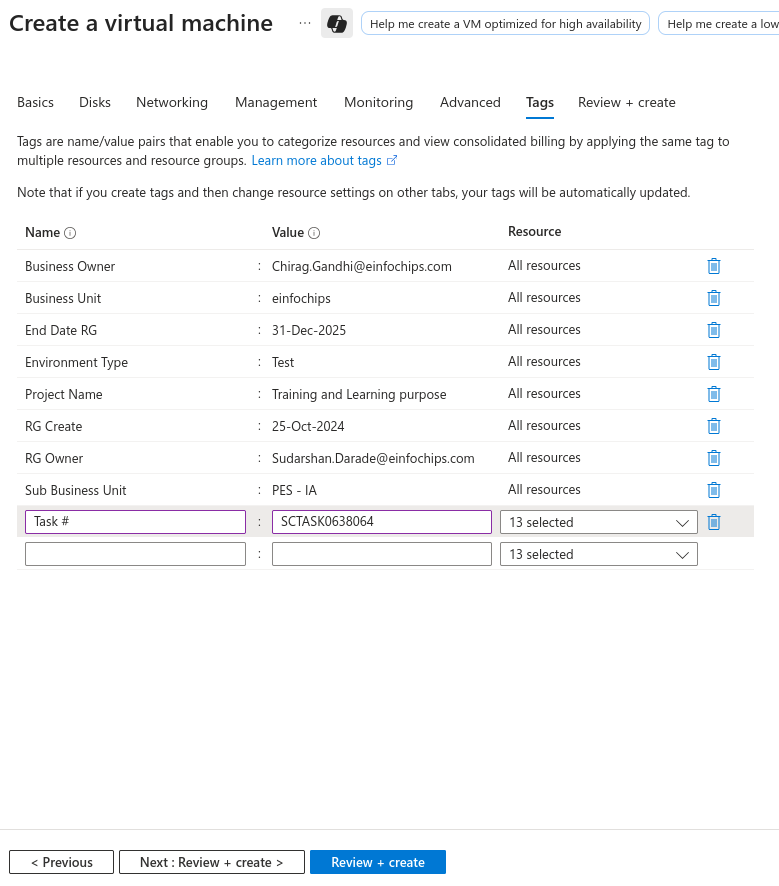
---

### 9. Access the VM

After the deployment:

- Go to the resource
- Copy the **public IP address**
- Connect via SSH using your private key:

```bash
# Get the public IP
VM_IP="<public-ip-from-portal>"

# Connect using SSH key
ssh -i ~/.ssh/azure-vm-key azureuser@$VM_IP
```

### 10. Alternative: Using Azure CLI

```bash
# Create VM with SSH key using CLI
az vm create \
  --resource-group sa1_test_eic_SudarshanDarade \
  --name linux-vm-01 \
  --image Ubuntu2404 \
  --admin-username azureuser \
  --ssh-key-values ~/.ssh/azure-vm-key.pub \
  --size Standard_B2s
```
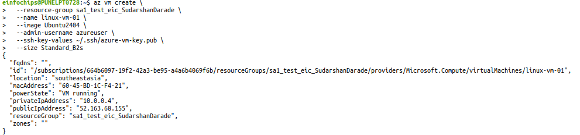

## Get public IP
```bash
az vm show -d -g sa1_test_eic_SudarshanDarade -n linux-vm-01 --query publicIps -o tsv
```
## Connect
```
ssh -i ~/.ssh/azure-vm-key azureuser@$(az vm show -d -g sa1_test_eic_SudarshanDarade -n linux-vm-01 --query publicIps -o tsv)
```
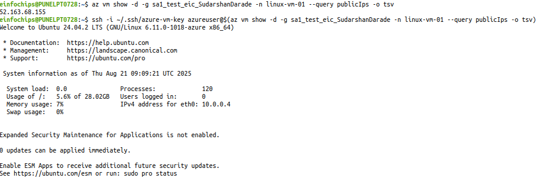

