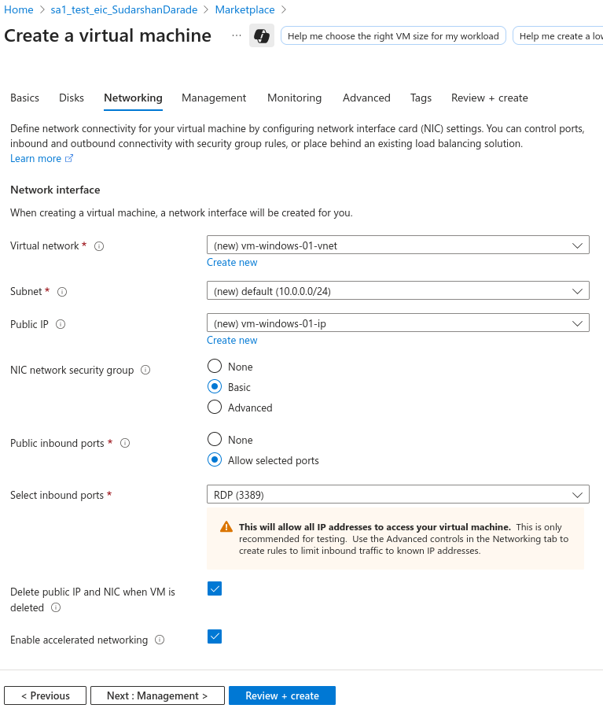

# Creating a Windows VM with IIS Web Server on Azure

This guide outlines the steps to create a Windows virtual machine on Azure and configure it with IIS web server.

## Prerequisites

- Active Microsoft Azure account
- Basic understanding of Windows Server administration
- RDP client for remote connection

---

## Steps

### 1. Create Windows Virtual Machine

#### Using Azure Portal

1. Navigate to **Virtual machines** > **Create**
2. **Basics Tab:**
   - Resource group: Create new `sa1_test_eic_SudarshanDarade`
   - VM name: `vm-windows-01`
   - Region: Southeast Asia
   - Image: Windows Server 2022 Datacenter
   - Size: Standard_B2s
   - Username: `azureuser`
   - Password: `P@ssw0rd123!`


3. **Disks Tab:**
   - OS disk type: Premium SSD
   - Encryption type: Default

   

4. **Networking Tab:**
   - Virtual network: Create new `vm-windows-01-vnet`
   - Subnet: Default
   - Public IP: Create new `vm-windows-01-ip`
   - Network security group: Create new `vm-windows-01NSG`

   

5. **Advanced Tab:**


6. **Monitoring Tab:**


7. Click **Review + Create**


8. Review the configuration and click **Create**


#### Using Azure CLI

```bash
# Create resource group
az group create --name sa1_test_eic_SudarshanDarade  --location southeastasia

# Create Windows VM
az vm create \
  --resource-group sa1_test_eic_SudarshanDarade \
  --name vm-windows-01 \
  --image Win2022Datacenter \
  --admin-username azureuser \
  --admin-password 'P@ssw0rd123!' \  
  --size Standard_B2s \
  --location southeastasia \
  --public-ip-sku Standard
```
Note : update your `admin password` in `--admin-password` section

### 2. Configure Network Security Group (NSG)
 **Networking Tab:**
   - Allow RDP (3389)
   - Allow HTTP (80)
   - Allow HTTPS (443)

Note : NSG should be allowed to your `local Network CIDR` or to your `Public IP address`

**Get your current public IP:**
```bash
# Get your current public IP
curl -s https://checkip.amazonaws.com
```


### 2. Configure Network Security Group

```bash
# Get your current public IP
MY_IP=$(curl -s https://checkip.amazonaws.com)
echo "Your current IP: $MY_IP"

# Allow RDP from your IP only
az network nsg rule create \
  --resource-group sa1_test_eic_SudarshanDarade \
  --nsg-name vm-windows-01NSG \
  --name allow-rdp-myip \
  --priority 900 \
  --source-address-prefixes "$MY_IP/32" \
  --destination-port-ranges 3389 \
  --access Allow \
  --protocol Tcp

# Allow HTTP from your IP only
az network nsg rule create \
  --resource-group sa1_test_eic_SudarshanDarade \
  --nsg-name vm-windows-01NSG \
  --name allow-http-myip \
  --priority 1000 \
  --source-address-prefixes "$MY_IP/32" \
  --destination-port-ranges 80 \
  --access Allow \
  --protocol Tcp

# Allow HTTPS from your IP only
az network nsg rule create \
  --resource-group sa1_test_eic_SudarshanDarade \
  --nsg-name vm-windows-01NSG \
  --name allow-https-myip \
  --priority 1010 \
  --source-address-prefixes "$MY_IP/32" \
  --destination-port-ranges 443 \
  --access Allow \
  --protocol Tcp

# Alternative: Manual IP specification
# Replace YOUR_IP_ADDRESS with your actual IP
# az network nsg rule create \
#   --resource-group sa1_test_eic_SudarshanDarade \
#   --nsg-name vm-windows-01NSG \
#   --name allow-rdp-myip \
#   --priority 900 \
#   --source-address-prefixes "YOUR_IP_ADDRESS/32" \
#   --destination-port-ranges 3389 \
#   --access Allow \
#   --protocol Tcp
```

#### Update NSG Rules for IP Changes

```bash
# Update existing rule with new IP
NEW_IP=$(curl -s https://ipinfo.io/ip)

# Update RDP rule
az network nsg rule update \
  --resource-group sa1_test_eic_SudarshanDarade \
  --nsg-name vm-windows-01NSG \
  --name allow-rdp-myip \
  --source-address-prefixes "$NEW_IP/32"

# Update HTTP rule
az network nsg rule update \
  --resource-group sa1_test_eic_SudarshanDarade \
  --nsg-name vm-windows-01NSG \
  --name allow-http-myip \
  --source-address-prefixes "$NEW_IP/32"

# Update HTTPS rule
az network nsg rule update \
  --resource-group sa1_test_eic_SudarshanDarade \
  --nsg-name vm-windows-01NSG \
  --name allow-https-myip \
  --source-address-prefixes "$NEW_IP/32"
```


### 3. Connect to Windows VM

#### Get Public IP Address

```bash
az vm show \
  --resource-group sa1_test_eic_SudarshanDarade \
  --name vm-windows-01 \
  --show-details \
  --query publicIps \
  --output tsv
```

#### RDP Connection

1. Open Remote Desktop Connection
2. Enter the public IP address
3. Username: `azureuser`
4. Password: `P@ssw0rd123!`


### 4. Install IIS Web Server

#### Method 1: Using PowerShell

```powershell
# Run as Administrator in PowerShell
Install-WindowsFeature -name Web-Server -IncludeManagementTools

# Install additional IIS features
Install-WindowsFeature -name Web-Common-Http
Install-WindowsFeature -name Web-Http-Errors
Install-WindowsFeature -name Web-Net-Ext45
Install-WindowsFeature -name Web-Asp-Net45
Install-WindowsFeature -name Web-ISAPI-Ext
Install-WindowsFeature -name Web-ISAPI-Filter
Install-WindowsFeature -name Web-Mgmt-Console
```

#### Method 2: Using Server Manager

1. Open **Server Manager**
2. Click **Add roles and features**
3. Select **Role-based or feature-based installation**
4. Select your server
5. Check **Web Server (IIS)**
6. Add required features
7. Complete installation

### 5. Configure IIS

#### Create Custom Web Page

```powershell
# Navigate to IIS root directory
cd C:\inetpub\wwwroot

# Create custom HTML page
@"
<!DOCTYPE html>
<html>
<head>
    <title>Azure Windows VM - IIS Server</title>
    <style>
        body { font-family: Arial, sans-serif; margin: 40px; }
        .header { background-color: #0078d4; color: white; padding: 20px; }
        .content { padding: 20px; }
    </style>
</head>
<body>
    <div class="header">
        <h1>Welcome to Azure Windows VM</h1>
    </div>
    <div class="content">
        <h2>IIS Web Server is Running!</h2>
        <p>Server Name: $env:COMPUTERNAME</p>
        <p>Server Time: $(Get-Date)</p>
        <p>Server IP: $(Get-NetIPAddress -AddressFamily IPv4 | Where-Object {$_.IPAddress -like "10.*"} | Select-Object -ExpandProperty IPAddress)</p>
    </div>
</body>
</html>
"@ | Out-File -FilePath "index.html" -Encoding UTF8
```


#### Configure IIS Settings

```powershell
# Import IIS module
Import-Module WebAdministration

# Set default document
Set-WebConfigurationProperty -Filter "system.webServer/defaultDocument/files" -Name Collection -Value @{value="index.html"}

# Enable directory browsing (optional)
Set-WebConfigurationProperty -Filter "system.webServer/directoryBrowse" -Name enabled -Value $true

# Restart IIS
iisreset
```

### 6. Test Web Server Connectivity

#### Local Testing (on VM)

```powershell
# Test local connectivity
Invoke-WebRequest -Uri "http://localhost" -UseBasicParsing

# Check IIS service status
Get-Service -Name W3SVC
```

#### External Testing

1. Open web browser
2. Navigate to `http://[VM-PUBLIC-IP]`
3. Verify custom page loads


### 7. Configure Windows Firewall

```powershell
# Allow HTTP traffic through Windows Firewall
New-NetFirewallRule -DisplayName "Allow HTTP" -Direction Inbound -Protocol TCP -LocalPort 80 -Action Allow

# Allow HTTPS traffic through Windows Firewall
New-NetFirewallRule -DisplayName "Allow HTTPS" -Direction Inbound -Protocol TCP -LocalPort 443 -Action Allow

# Check firewall rules
Get-NetFirewallRule -DisplayName "*HTTP*" | Select-Object DisplayName, Enabled, Direction
```

### 8. Enable HTTPS (Optional)

#### Create Self-Signed Certificate

```powershell
# Create self-signed certificate
$cert = New-SelfSignedCertificate -DnsName "vm-windows-iis.cloudapp.net" -CertStoreLocation "cert:\LocalMachine\My"

# Bind certificate to IIS
New-WebBinding -Name "Default Web Site" -Protocol https -Port 443
$binding = Get-WebBinding -Name "Default Web Site" -Protocol https
$binding.AddSslCertificate($cert.Thumbprint, "my")
```

### 9. Monitoring and Maintenance

#### Check IIS Logs

```powershell
# View IIS access logs
Get-Content "C:\inetpub\logs\LogFiles\W3SVC1\*.log" | Select-Object -Last 10

# Monitor IIS performance
Get-Counter "\Web Service(_Total)\Current Connections"
```

#### Automated Deployment Script

```powershell
# Complete automation script
# Install IIS
Install-WindowsFeature -name Web-Server -IncludeManagementTools

# Configure firewall
New-NetFirewallRule -DisplayName "Allow HTTP" -Direction Inbound -Protocol TCP -LocalPort 80 -Action Allow

# Create custom page
$html = @"
<!DOCTYPE html>
<html>
<head><title>Azure IIS Server</title></head>
<body>
<h1>IIS Server Running on Azure VM</h1>
<p>Hostname: $env:COMPUTERNAME</p>
<p>Time: $(Get-Date)</p>
</body>
</html>
"@

$html | Out-File -FilePath "C:\inetpub\wwwroot\index.html" -Encoding UTF8

# Restart IIS
iisreset
```

---

## Verification Steps

1. **VM Status**: Verify VM is running in Azure Portal
2. **RDP Access**: Confirm remote desktop connectivity
3. **IIS Service**: Check W3SVC service is running
4. **Web Access**: Test HTTP connectivity from external browser
5. **Firewall**: Verify Windows Firewall and NSG rules
6. **Logs**: Check IIS logs for access entries

---

## Troubleshooting

### Common Issues

1. **Cannot RDP**: Check NSG rules allow port 3389
2. **Web page not loading**: Verify IIS service and firewall rules
3. **403 Forbidden**: Check file permissions and default document settings
4. **Slow performance**: Consider upgrading VM size

### Diagnostic Commands

```powershell
# Check IIS status
Get-Service W3SVC

# Test network connectivity
Test-NetConnection -ComputerName "8.8.8.8" -Port 80

# Check listening ports
netstat -an | findstr :80

# View Windows event logs
Get-EventLog -LogName System -Source "Microsoft-Windows-IIS*" -Newest 10
```

---

## Cleanup

```bash
# Delete resource group and all resources
az group delete --name sa1_test_eic_SudarshanDarade --yes --no-wait
```

---

## Security Best Practices

1. Use strong passwords and consider Azure AD integration
2. Enable Windows Updates and security patches
3. Configure SSL/TLS certificates for HTTPS
4. Implement proper backup strategies
5. Monitor access logs regularly
6. Use Azure Security Center recommendations