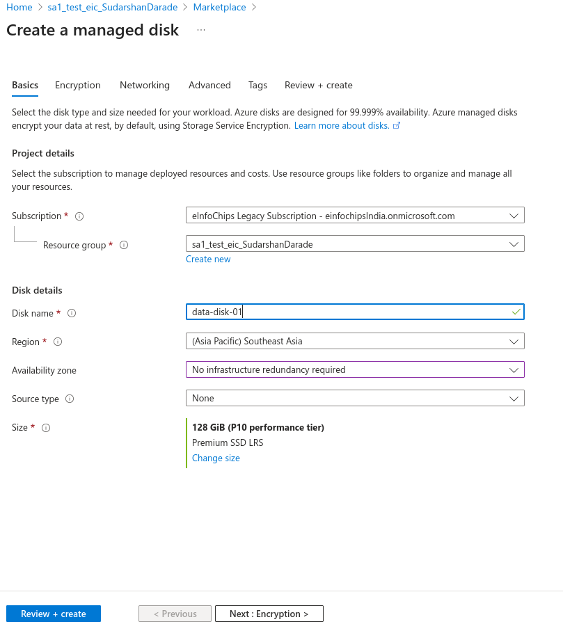
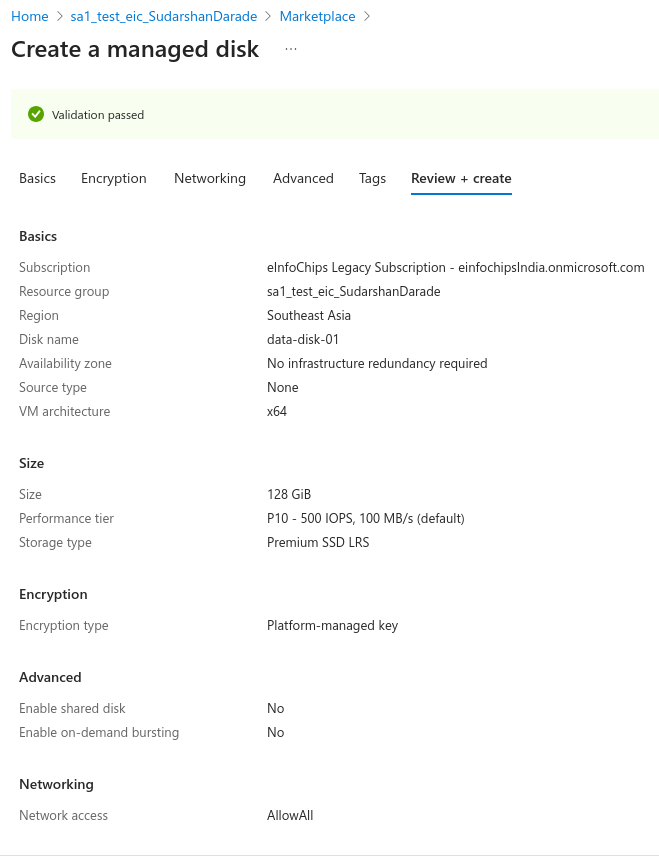
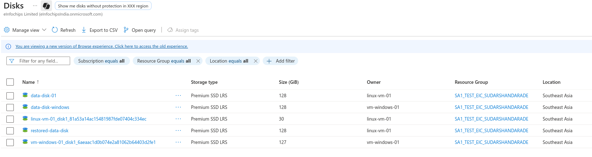
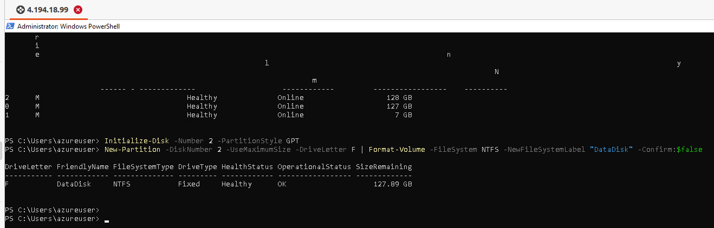
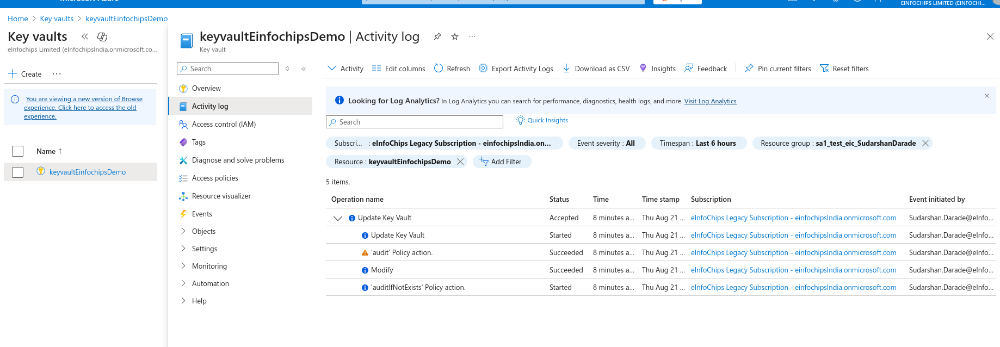
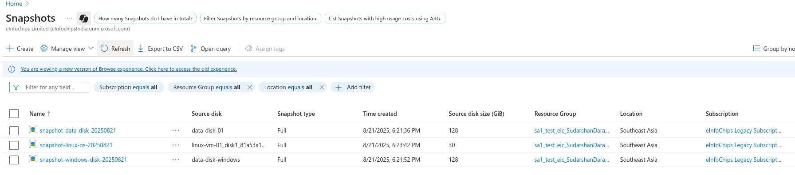
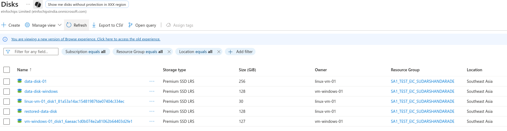
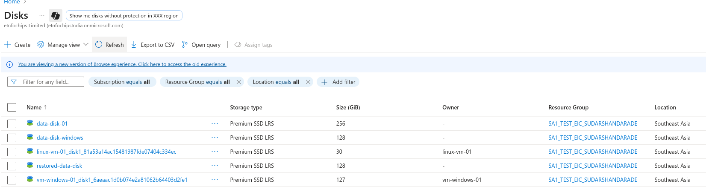

# Managing Data Disks on Azure VMs with Encryption and Snapshots

This guide covers creating, attaching, encrypting, and managing data disks for both Linux and Windows VMs on Azure.

## Prerequisites

- Active Microsoft Azure account
- Existing Linux and Windows VMs
- Azure CLI or PowerShell installed
- Appropriate permissions for disk management

---

## Steps

### 1. Create Data Disk

#### Using Azure CLI

```bash
# Create managed data disk
az disk create \
  --resource-group sa1_test_eic_SudarshanDarade \
  --name data-disk-01 \
  --size-gb 128 \
  --sku Premium_LRS \
  --location southeastasia
```

#### Using Azure Portal

1. Navigate to **Disks** > **Create**
2. **Basics:**
   - Resource group: `sa1_test_eic_SudarshanDarade`
   - Disk name: `data-disk-01`
   - Region: SouthEast Asia
   - Availability zone: None
   - Source type: None (empty disk)
   - Size: 128 GiB
   - Disk SKU: Premium SSD

 


3. **Review + Create:**



### 2. Attach Data Disk to Linux VM

#### Using Azure CLI

```bash
# Attach disk to Linux VM
az vm disk attach \
  --resource-group sa1_test_eic_SudarshanDarade \
  --vm-name linux-vm-01 \
  --name data-disk-01
```

#### Configure Disk on Linux VM

```bash
# SSH into Linux VM
ssh -i ~/.ssh/azure-vm-key azureuser@<vm-ip>

# List available disks
lsblk

# Create partition (assuming disk is /dev/sdc)
sudo fdisk /dev/sdc
# Press 'n' for new partition, accept defaults, press 'w' to write

# Format the partition
sudo mkfs.ext4 /dev/sdc1

# Create mount point
sudo mkdir /datadrive

# Mount the disk
sudo mount /dev/sdc1 /datadrive

# Add to fstab for persistent mounting
echo '/dev/sdc1 /datadrive ext4 defaults,nofail 1 2' | sudo tee -a /etc/fstab

# Verify mount
df -h
```

### 3. Attach Data Disk to Windows VM

#### Using Azure CLI

```bash
# Create another data disk for Windows
az disk create \
  --resource-group sa1_test_eic_SudarshanDarade \
  --name data-disk-windows \
  --size-gb 128 \
  --sku Premium_LRS

# Attach to Windows VM
az vm disk attach \
  --resource-group sa1_test_eic_SudarshanDarade \
  --vm-name vm-windows-01 \
  --name data-disk-windows
```


#### Configure Disk on Windows VM

```powershell
# RDP into Windows VM and run PowerShell as Administrator

# List available disks
Get-Disk

# Initialize the disk (assuming disk number 2)
Initialize-Disk -Number 2 -PartitionStyle GPT

# Create partition and format
New-Partition -DiskNumber 2 -UseMaximumSize -DriveLetter F | Format-Volume -FileSystem NTFS -NewFileSystemLabel "DataDisk" -Confirm:$false

# Verify
Get-Volume
```


### 4. Enable Disk Encryption

#### Create Key Vault

```bash
# Create Key Vault for encryption keys
az keyvault create \
  --name kv-disk-encryption-$(date +%s) \
  --resource-group sa1_test_eic_SudarshanDarade \
  --location southeastasia \
  --enabled-for-disk-encryption true
```

#### Enable Encryption on Linux VM

```bash
# Get Key Vault resource ID
KV_ID=$(az keyvault show --name kv-disk-encryption-* --resource-group sa1_test_eic_SudarshanDarade --query id -o tsv)

# Enable encryption on Linux VM
az vm encryption enable \
  --resource-group sa1_test_eic_SudarshanDarade \
  --name linux-vm-01 \
  --disk-encryption-keyvault $KV_ID \
  --volume-type All

# Check encryption status
az vm encryption show \
  --resource-group sa1_test_eic_SudarshanDarade \
  --name linux-vm-01
```

#### Enable Encryption on Windows VM

```bash
# Enable encryption on Windows VM
az vm encryption enable \
  --resource-group sa1_test_eic_SudarshanDarade \
  --name vm-windows-01 \
  --disk-encryption-keyvault $KV_ID \
  --volume-type All

# Check encryption status
az vm encryption show \
  --resource-group sa1_test_eic_SudarshanDarade \
  --name vm-windows-01
```


### 5. Create Disk Snapshots

#### Create Snapshot of Data Disk

```bash
# Create snapshot of Linux data disk
az snapshot create \
  --resource-group sa1_test_eic_SudarshanDarade \
  --name snapshot-data-disk-$(date +%Y%m%d) \
  --source data-disk-01

# Create snapshot of Windows data disk
az snapshot create \
  --resource-group sa1_test_eic_SudarshanDarade \
  --name snapshot-windows-disk-$(date +%Y%m%d) \
  --source data-disk-windows
```

#### Create VM Snapshot (OS Disk)

```bash
# Get OS disk name
LINUX_OS_DISK=$(az vm show --resource-group sa1_test_eic_SudarshanDarade --name linux-vm-01 --query "storageProfile.osDisk.name" -o tsv)

# Create OS disk snapshot
az snapshot create \
  --resource-group sa1_test_eic_SudarshanDarade \
  --name snapshot-linux-os-$(date +%Y%m%d) \
  --source $LINUX_OS_DISK
```


### 6. Restore from Snapshot

#### Create Disk from Snapshot

```bash
# Create new disk from snapshot
az disk create \
  --resource-group sa1_test_eic_SudarshanDarade \
  --name restored-data-disk \
  --source snapshot-data-disk-* \
  --size-gb 128

# Attach restored disk to VM
az vm disk attach \
  --resource-group sa1_test_eic_SudarshanDarade \
  --vm-name linux-vm-01 \
  --name restored-data-disk
```


### 7. Disk Performance Monitoring

#### Linux Monitoring Commands

```bash
# Monitor disk I/O
iostat -x 1

# Check disk usage
df -h

# Monitor disk performance
iotop

# Check disk health
sudo smartctl -a /dev/sdc
```

#### Windows Monitoring Commands

```powershell
# Check disk performance
Get-Counter "\PhysicalDisk(*)\Disk Reads/sec"
Get-Counter "\PhysicalDisk(*)\Disk Writes/sec"

# Monitor disk space
Get-WmiObject -Class Win32_LogicalDisk | Select-Object DeviceID, Size, FreeSpace

# Check disk health
Get-PhysicalDisk | Get-StorageReliabilityCounter
```

### 8. Automated Backup Script

#### Linux Backup Script

```bash
#!/bin/bash
# Create automated snapshot script

RESOURCE_GROUP="sa1_test_eic_SudarshanDarade"
DISK_NAME="data-disk-01"
DATE=$(date +%Y%m%d-%H%M)

# Create snapshot
az snapshot create \
  --resource-group $RESOURCE_GROUP \
  --name "auto-snapshot-$DATE" \
  --source $DISK_NAME

# Clean up old snapshots (keep last 7 days)
az snapshot list \
  --resource-group $RESOURCE_GROUP \
  --query "[?contains(name, 'auto-snapshot') && timeCreated < '$(date -d '7 days ago' -Iseconds)'].name" \
  -o tsv | xargs -I {} az snapshot delete --resource-group $RESOURCE_GROUP --name {}
```

#### Windows Backup Script

```powershell
# PowerShell backup script
$ResourceGroup = "sa1_test_eic_SudarshanDarade"
$DiskName = "data-disk-windows"
$Date = Get-Date -Format "yyyyMMdd-HHmm"

# Create snapshot
az snapshot create `
  --resource-group $ResourceGroup `
  --name "auto-snapshot-windows-$Date" `
  --source $DiskName

# Clean up old snapshots
$OldSnapshots = az snapshot list --resource-group $ResourceGroup --query "[?contains(name, 'auto-snapshot-windows') && timeCreated < '$(Get-Date (Get-Date).AddDays(-7) -Format 'yyyy-MM-ddTHH:mm:ssZ')'].name" -o tsv
foreach ($snapshot in $OldSnapshots) {
    az snapshot delete --resource-group $ResourceGroup --name $snapshot
}
```

### 9. Disk Expansion

#### Expand Disk Size

```bash
# Resize disk (increase size only)
az disk update \
  --resource-group sa1_test_eic_SudarshanDarade \
  --name data-disk-01 \
  --size-gb 256
```

#### Expand Filesystem on Linux

```bash
# SSH into VM
ssh -i ~/.ssh/azure-vm-key azureuser@<vm-ip>
# list storage devices
lsblk
# Resize partition (for ext4)
sudo growpart /dev/sdc 1
sudo resize2fs /dev/sdc1

# Verify new size
df -h /datadrive
```


#### Expand Filesystem on Windows

```powershell
# RDP into Windows VM
# Extend partition using Disk Management GUI or PowerShell

# Using PowerShell
$DriveLetter = "F"
$Partition = Get-Partition -DriveLetter $DriveLetter
$Partition | Resize-Partition -Size (Get-PartitionSupportedSize -DriveLetter $DriveLetter).SizeMax
```

### 10. Disk Detachment and Cleanup

#### Detach Data Disk

```bash
# Detach disk from Linux VM
az vm disk detach \
  --resource-group sa1_test_eic_SudarshanDarade \
  --vm-name linux-vm-01 \
  --name data-disk-01

# Detach disk from Windows VM
az vm disk detach \
  --resource-group sa1_test_eic_SudarshanDarade \
  --vm-name vm-windows-01 \
  --name data-disk-windows
```


#### Before Detaching (Linux)

```bash
# Unmount the disk first
sudo umount /datadrive

# Remove from fstab
sudo sed -i '/\/datadrive/d' /etc/fstab
```

#### Before Detaching (Windows)

```powershell
# No specific steps needed, just ensure no applications are using the drive
```

---

## Verification Commands

### Check Disk Status

```bash
# List all disks in resource group
az disk list --resource-group sa1_test_eic_SudarshanDarade --output table

# Check VM disk configuration
az vm show --resource-group sa1_test_eic_SudarshanDarade --name linux-vm-01 --query storageProfile

# List snapshots
az snapshot list --resource-group sa1_test_eic_SudarshanDarade --output table
```

### Check Encryption Status

```bash
# Check encryption status for all VMs
az vm encryption show --resource-group sa1_test_eic_SudarshanDarade --name linux-vm-01
az vm encryption show --resource-group sa1_test_eic_SudarshanDarade --name vm-windows-01
```

---

## Best Practices

1. **Performance**: Use Premium SSD for production workloads
2. **Backup**: Create regular snapshots before major changes
3. **Encryption**: Enable encryption for sensitive data
4. **Monitoring**: Set up alerts for disk space and performance
5. **Sizing**: Plan disk sizes carefully (expansion is easier than shrinking)
6. **Availability**: Use managed disks for better reliability

---

## Troubleshooting

### Common Issues

1. **Disk not visible**: Check if disk is attached and VM is restarted
2. **Mount fails**: Verify filesystem type and mount point permissions
3. **Encryption fails**: Ensure Key Vault permissions are correct
4. **Snapshot fails**: Check if disk is in use or VM is running

### Diagnostic Commands

```bash
# Linux diagnostics
lsblk
fdisk -l
mount | grep /dev/sd
dmesg | grep -i error

# Windows diagnostics (PowerShell)
Get-Disk
Get-Partition
Get-Volume
Get-EventLog -LogName System -Source "disk" -Newest 10
```

---

## Cleanup

```bash
# Delete snapshots
az snapshot delete --resource-group sa1_test_eic_SudarshanDarade --name snapshot-data-disk-*

# Delete disks
az disk delete --resource-group sa1_test_eic_SudarshanDarade --name data-disk-01 --yes
az disk delete --resource-group sa1_test_eic_SudarshanDarade --name data-disk-windows --yes

# Delete Key Vault
az keyvault delete --name kv-disk-encryption-* --resource-group sa1_test_eic_SudarshanDarade
```