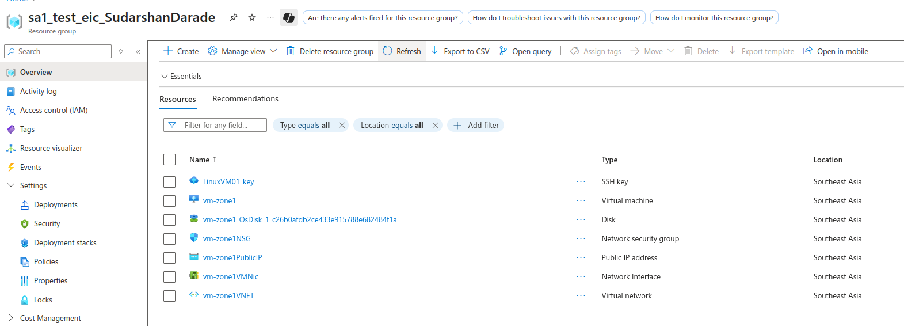
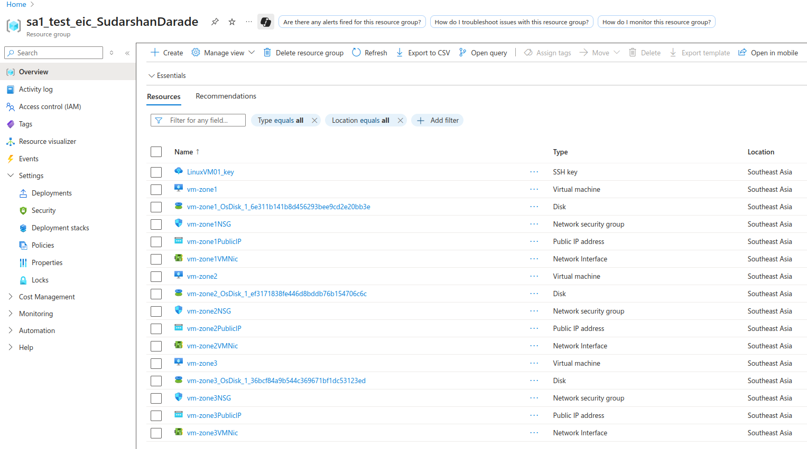
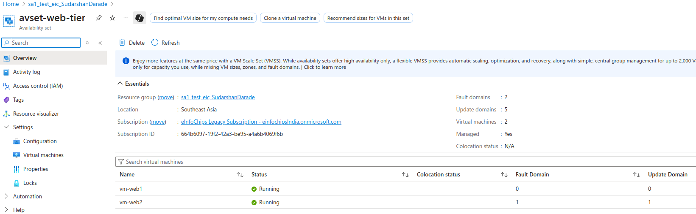

# Azure High Availability: Regions, Availability Sets, Zones, and Domains

This guide covers Azure's high availability concepts and implementation strategies for resilient infrastructure.

## Overview

Azure provides multiple layers of availability and fault tolerance through geographic distribution and infrastructure redundancy.

---

## Azure Regions

### What are Azure Regions?

Azure regions are geographic areas containing one or more datacenters connected through a dedicated regional low-latency network.

### Key Characteristics

- **Geographic Distribution**: 60+ regions worldwide
- **Compliance**: Meet data residency and compliance requirements
- **Latency**: Choose regions closest to users
- **Service Availability**: Not all services available in all regions

### List Available Regions

```bash
# List all available regions
az account list-locations --output table

# List regions with specific services
az provider show --namespace Microsoft.Compute --query "resourceTypes[?resourceType=='virtualMachines'].locations" --output table
```

### Region Pairs

Azure regions are paired for disaster recovery and data replication.

```bash
# Check region pairs
az account list-locations --query "[].{Name:name, DisplayName:displayName, RegionPair:metadata.pairedRegion[0].name}" --output table
```

**Common Region Pairs:**
- East US ↔ West US
- North Europe ↔ West Europe
- Southeast Asia ↔ East Asia

---

## Availability Zones

### What are Availability Zones?

Physically separate locations within an Azure region, each with independent power, cooling, and networking.

### Characteristics

- **Physical Separation**: Minimum 3 zones per region
- **Independent Infrastructure**: Separate power, cooling, networking
- **Low Latency**: <2ms latency between zones
- **99.99% SLA**: When using multiple zones

### Check Zone Support

```bash
# Check if region supports availability zones
az vm list-skus --location southeastasia --query "[?contains(locationInfo[0].zones, '1')].{Name:name, Zones:locationInfo[0].zones}" --output table

# List zone-supported VM sizes
az vm list-sizes --location southeastasia --output table
```

### Deploy VM with Availability Zone

```bash
# Create VM in specific availability zone
az vm create \
  --resource-group sa1_test_eic_SudarshanDarade \
  --name vm-zone1 \
  --image Ubuntu2204 \
  --admin-username azureuser \
  --ssh-key-values ~/.ssh/azure-vm-key.pub \
  --location southeastasia \
  --zone 1 \
  --size Standard_B2s
```



### Multi-Zone Deployment

```bash
# Create VMs across multiple zones
for zone in 1 2 3; do
  az vm create \
    --resource-group sa1_test_eic_SudarshanDarade \
    --name vm-zone$zone \
    --image Ubuntu2204 \
    --admin-username azureuser \
    --ssh-key-values ~/.ssh/azure-vm-key.pub \
    --location southeastasia \
    --zone $zone \
    --size Standard_B2s
done
```


---

## Availability Sets

### What are Availability Sets?

Logical grouping of VMs that ensures they are deployed across multiple fault and update domains within a datacenter.

### Key Concepts

- **Fault Domains**: Separate power and network infrastructure
- **Update Domains**: Separate maintenance windows
- **99.95% SLA**: When using availability sets

### Create Availability Set

```bash
# Create availability set
az vm availability-set create \
  --resource-group sa1_test_eic_SudarshanDarade \
  --name avset-web-tier \
  --platform-fault-domain-count 2 \
  --platform-update-domain-count 5 \
  --location southeastasia
```

### Deploy VMs in Availability Set

```bash
# Create VMs in availability set
az vm create \
  --resource-group sa1_test_eic_SudarshanDarade \
  --name vm-web1 \
  --availability-set avset-web-tier \
  --image Ubuntu2204 \
  --admin-username azureuser \
  --ssh-key-values ~/.ssh/azure-vm-key.pub \
  --size Standard_B2s

az vm create \
  --resource-group sa1_test_eic_SudarshanDarade \
  --name vm-web2 \
  --availability-set avset-web-tier \
  --image Ubuntu2204 \
  --admin-username azureuser \
  --ssh-key-values ~/.ssh/azure-vm-key.pub \
  --size Standard_B2s
```

---

## Fault Domains

### What are Fault Domains?

Logical groups of hardware that share a common power source and network switch.

### Characteristics

- **Hardware Separation**: Different racks, power, networking
- **Maximum Count**: Up to 3 fault domains per availability set
- **Automatic Distribution**: Azure distributes VMs across fault domains

### Check Fault Domain Assignment

```bash
# Check VM fault domain assignment
az vm get-instance-view \
  --resource-group sa1_test_eic_SudarshanDarade \
  --name vm-web1 \
  --query "platformFaultDomain"
```

### Fault Domain Configuration

```bash
# Create availability set with specific fault domain count
az vm availability-set create \
  --resource-group sa1_test_eic_SudarshanDarade \
  --name avset-app-tier \
  --platform-fault-domain-count 3 \
  --platform-update-domain-count 5
```

---

## Update Domains

### What are Update Domains?

Logical groups of hardware that can be updated and rebooted simultaneously during planned maintenance.

### Characteristics

- **Maintenance Windows**: Only one update domain updated at a time
- **Maximum Count**: Up to 20 update domains
- **Default Count**: 5 update domains
- **Reboot Coordination**: Prevents simultaneous reboots

### Check Update Domain Assignment

```bash
# Check VM update domain assignment
az vm get-instance-view \
  --resource-group sa1_test_eic_SudarshanDarade \
  --name vm-web1 \
  --query "platformUpdateDomain"
```

### Update Domain Configuration

```bash
# Create availability set with specific update domain count
az vm availability-set create \
  --resource-group sa1_test_eic_SudarshanDarade \
  --name avset-db-tier \
  --platform-fault-domain-count 2 \
  --platform-update-domain-count 10
```

---

## High Availability Scenarios

### Scenario 1: Web Application with Load Balancer

```bash
# Create resource group
az group create --name rg-web-ha --location southeastasia

# Create availability set
az vm availability-set create \
  --resource-group rg-web-ha \
  --name avset-web \
  --platform-fault-domain-count 2 \
  --platform-update-domain-count 5

# Create load balancer
az network lb create \
  --resource-group rg-web-ha \
  --name lb-web \
  --sku Standard \
  --public-ip-address lb-web-ip

# Create backend pool
az network lb address-pool create \
  --resource-group rg-web-ha \
  --lb-name lb-web \
  --name backend-pool

# Create VMs in availability set
for i in 1 2; do
  az vm create \
    --resource-group rg-web-ha \
    --name vm-web$i \
    --availability-set avset-web \
    --image Ubuntu2204 \
    --admin-username azureuser \
    --ssh-key-values ~/.ssh/azure-vm-key.pub \
    --size Standard_B2s \
    --public-ip ""
done
```

### Scenario 2: Multi-Zone Database Deployment

```bash
# Create resource group
az group create --name rg-db-ha --location southeastasia

# Create VMs across availability zones
az vm create \
  --resource-group rg-db-ha \
  --name vm-db-primary \
  --image Ubuntu2204 \
  --admin-username azureuser \
  --ssh-key-values ~/.ssh/azure-vm-key.pub \
  --zone 1 \
  --size Standard_D2s_v3

az vm create \
  --resource-group rg-db-ha \
  --name vm-db-secondary \
  --image Ubuntu2204 \
  --admin-username azureuser \
  --ssh-key-values ~/.ssh/azure-vm-key.pub \
  --zone 2 \
  --size Standard_D2s_v3
```

### Scenario 3: Cross-Region Disaster Recovery

```bash
# Primary region deployment
az group create --name rg-primary --location southeastasia

az vm create \
  --resource-group rg-primary \
  --name vm-primary \
  --image Ubuntu2204 \
  --admin-username azureuser \
  --ssh-key-values ~/.ssh/azure-vm-key.pub \
  --zone 1 \
  --size Standard_B2s

# Secondary region deployment
az group create --name rg-secondary --location westus

az vm create \
  --resource-group rg-secondary \
  --name vm-secondary \
  --image Ubuntu2204 \
  --admin-username azureuser \
  --ssh-key-values ~/.ssh/azure-vm-key.pub \
  --zone 1 \
  --size Standard_B2s
```

---

## SLA Comparison

| Configuration | SLA | Use Case |
|---------------|-----|----------|
| Single VM (Premium SSD) | 99.9% | Development/Testing |
| Availability Set | 99.95% | Production (single region) |
| Availability Zone | 99.99% | Mission-critical (single region) |
| Multi-Region | 99.99%+ | Disaster recovery |

---

## Monitoring and Verification

### Check VM Placement

```bash
# Get detailed VM information
az vm get-instance-view \
  --resource-group sa1_test_eic_SudarshanDarade \
  --name vm-web1 \
  --query "{Name:name, Zone:zones[0], FaultDomain:platformFaultDomain, UpdateDomain:platformUpdateDomain, ProvisioningState:provisioningState}"

# List all VMs with placement info
az vm list \
  --resource-group sa1_test_eic_SudarshanDarade \
  --show-details \
  --query "[].{Name:name, Zone:zones[0], Location:location, PowerState:powerState}" \
  --output table
```

### Availability Set Status

```bash
# Check availability set configuration
az vm availability-set show \
  --resource-group sa1_test_eic_SudarshanDarade \
  --name avset-web-tier \
  --query "{Name:name, FaultDomains:platformFaultDomainCount, UpdateDomains:platformUpdateDomainCount, VMs:virtualMachines[].id}"
```

### Health Monitoring

```bash
# Check VM health status
az vm get-instance-view \
  --resource-group sa1_test_eic_SudarshanDarade \
  --name vm-web1 \
  --query "instanceView.statuses[?code=='PowerState/running']"

# Monitor availability metrics
az monitor metrics list \
  --resource /subscriptions/{subscription-id}/resourceGroups/sa1_test_eic_SudarshanDarade/providers/Microsoft.Compute/virtualMachines/vm-web1 \
  --metric "Percentage CPU" \
  --interval PT1M
```

---

## Best Practices

### Design Principles

1. **Distribute Workloads**: Use availability zones for critical applications
2. **Separate Tiers**: Different availability sets for web, app, and database tiers
3. **Load Balancing**: Distribute traffic across multiple instances
4. **Data Replication**: Implement database replication across zones/regions
5. **Monitoring**: Set up health checks and alerts

### Implementation Guidelines

```bash
# Multi-tier application with proper separation
# Web tier
az vm availability-set create \
  --resource-group rg-production \
  --name avset-web \
  --platform-fault-domain-count 3 \
  --platform-update-domain-count 5

# App tier
az vm availability-set create \
  --resource-group rg-production \
  --name avset-app \
  --platform-fault-domain-count 3 \
  --platform-update-domain-count 5

# Database tier (using zones)
# Deploy database VMs across zones 1, 2, and 3
```

### Cost Optimization

1. **Right-sizing**: Choose appropriate VM sizes
2. **Reserved Instances**: Use reservations for predictable workloads
3. **Auto-scaling**: Implement scale sets for dynamic scaling
4. **Spot Instances**: Use spot VMs for fault-tolerant workloads

---

## Troubleshooting

### Common Issues

1. **Zone Unavailable**: Check region zone support
2. **Allocation Failures**: Try different VM sizes or regions
3. **SLA Not Met**: Verify proper configuration across domains/zones

### Diagnostic Commands

```bash
# Check resource quotas
az vm list-usage --location southeastasia --output table

# Verify zone support for VM size
az vm list-skus --location southeastasia --size Standard_B2s --query "[].{Name:name, Zones:locationInfo[0].zones}"

# Check availability set constraints
az vm availability-set show --resource-group sa1_test_eic_SudarshanDarade --name avset-web-tier
```

---

## Cleanup

```bash
# Delete resource groups
az group delete --name sa1_test_eic_SudarshanDarade --yes --no-wait
az group delete --name rg-web-ha --yes --no-wait
az group delete --name rg-db-ha --yes --no-wait
az group delete --name rg-primary --yes --no-wait
az group delete --name rg-secondary --yes --no-wait
```