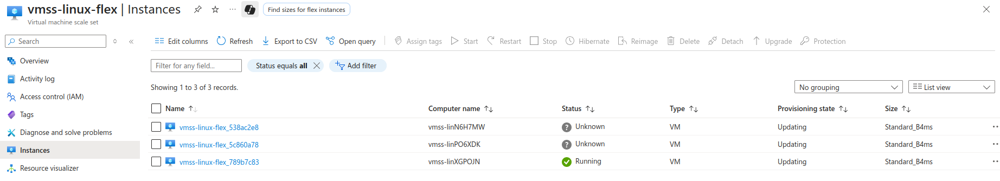

# Azure Virtual Machine Scale Sets with Flexible Orchestration

This guide covers creating and managing Virtual Machine Scale Sets (VMSS) using flexible orchestration mode with manual scaling for both Linux and Windows VMs.

## Overview

Azure VMSS with flexible orchestration provides:
- **Manual Scaling**: Control over instance count
- **Mixed Instance Types**: Different VM sizes in same scale set
- **Availability Zone Distribution**: Automatic distribution across zones
- **Simplified Management**: Unified management interface

---

## Prerequisites

- Active Microsoft Azure account
- Azure CLI installed
- SSH key pair for Linux VMs
- Basic understanding of load balancing concepts

---

## Manual VMSS Creation in Flexible Mode

### Azure Portal Steps

#### 1. Create VMSS via Portal
1. Navigate to **Virtual machine scale sets** > **Create**
2. **Basics Tab:**
   - Resource group: `sa1_test_eic_SudarshanDarade`
   - Scale set name: `vmss-flex-manual`
   - Region: `Southeast Asia`
   - Orchestration mode: **Flexible**
   - Image: `Ubuntu 24.04 LTS`
   - Size: `Standard_B2as v2`
   - Authentication: SSH public key
   - Username: `azureuser`
   - SSH public key: Upload your key


3. **Disks Tab:**
   - OS disk type: `Premium SSD`
   - Encryption type: `Default`


4. **Networking Tab:**
   - Virtual network: Create new `vnet-vmss-flex`
   - Subnet: Create new `subnet-vmss` (10.0.1.0/24)
   - Public IP: `Enabled`
   - Load balancer: `None` (for manual mode)
   - Network security group: `Basic`


5. **Management Tab:**
   - Upgrade policy: `Manual`
   - Enable system assigned managed identity: `Yes`


6. **Advanced Tab:**
   - Custom data: Add nginx installation script
   ```bash
   #!/bin/bash
   apt-get update
   apt-get install -y nginx
   systemctl start nginx
   systemctl enable nginx
   echo "<h1>VMSS Instance: $(hostname)</h1>" > /var/www/html/index.html
   ```


7. Click **Review + Create** > **Create**


#### 2. Manual Scaling Operations via Portal

**Scale Out:**
1. Navigate to your VMSS
2. Go to **Settings** > **Scaling**
3. Adjust **Instance count** slider to desired number
4. Click **Save**


**Scale In:**
1. Navigate to **Settings** > **Instances**
2. Select specific instances to remove
3. Click **Delete**
4. Confirm deletion


**Individual Instance Management:**

1. Go to **Settings** > **Instances**
2. Select instance
3. Available actions:
   - **Start/Stop/Restart**
   - **Reimage**
   - **Upgrade**
   - **Delete**


#### 3. PowerShell Manual Creation

```powershell
# Create resource group
New-AzResourceGroup -Name "rg-vmss-flex-manual" -Location "Southeast Asia"

# Create virtual network
$subnet = New-AzVirtualNetworkSubnetConfig -Name "subnet-vmss" -AddressPrefix "10.0.1.0/24"
$vnet = New-AzVirtualNetwork -ResourceGroupName "sa1_test_eic_SudarshanDarade" -Location "Southeast Asia" -Name "vnet-vmss-flex" -AddressPrefix "10.0.0.0/16" -Subnet $subnet

# Create VMSS configuration
$vmssConfig = New-AzVmssConfig -Location "Southeast Asia" -SkuCapacity 2 -SkuName "Standard_B2s" -OrchestrationMode "Flexible" -PlatformFaultDomainCount 1 -Zone @("1", "2", "3")

# Set OS profile
$vmssConfig = Set-AzVmssOsProfile -VirtualMachineScaleSet $vmssConfig -ComputerNamePrefix "vmss" -AdminUsername "azureuser" -LinuxConfigurationDisablePasswordAuthentication $true

# Add SSH key
$sshKey = @{Path = "/home/azureuser/.ssh/authorized_keys"; KeyData = Get-Content "~/.ssh/azure-vm-key.pub"}
$vmssConfig = Set-AzVmssOsProfile -VirtualMachineScaleSet $vmssConfig -LinuxConfigurationSshPublicKey $sshKey

# Set storage profile
$vmssConfig = Set-AzVmssStorageProfile -VirtualMachineScaleSet $vmssConfig -ImageReferencePublisher "Canonical" -ImageReferenceOffer "0001-com-ubuntu-server-jammy" -ImageReferenceSku "22_04-lts-gen2" -ImageReferenceVersion "latest" -OsDiskCreateOption "FromImage" -OsDiskCaching "ReadWrite"

# Set network profile
$ipConfig = New-AzVmssIpConfig -Name "vmss-ip-config" -SubnetId $vnet.Subnets[0].Id -PublicIpAddressConfigurationName "vmss-pip"
$networkProfile = New-AzVmssNetworkInterfaceConfiguration -Name "vmss-nic" -Primary $true -IpConfiguration $ipConfig
$vmssConfig = Add-AzVmssNetworkInterfaceConfiguration -VirtualMachineScaleSet $vmssConfig -NetworkInterfaceConfiguration $networkProfile

# Create VMSS
New-AzVmss -ResourceGroupName "sa1_test_eic_SudarshanDarade" -Name "vmss-flex-manual" -VirtualMachineScaleSet $vmssConfig
```

---

## Linux VMSS with Flexible Orchestration Using Azure Cli

### 1. Create Resource Group and Prerequisites

```bash
# Create resource group
az group create \
  --name sa1_test_eic_SudarshanDarade \
  --location southeastasia

# Generate SSH key if not exists
ssh-keygen -t rsa -b 4096 -f ~/.ssh/azure-vm-key -N ""
```

### 2. Create Virtual Network

```bash
# Create virtual network
az network vnet create \
  --resource-group sa1_test_eic_SudarshanDarade \
  --name vnet-vmss \
  --address-prefix 10.0.0.0/16 \
  --subnet-name subnet-vmss \
  --subnet-prefix 10.0.1.0/24
```

### 3. Create Linux VMSS with Flexible Orchestration

```bash
# Create Linux VMSS
az vmss create \
  --resource-group sa1_test_eic_SudarshanDarade \
  --name vmss-linux-flex \
  --image Ubuntu2204 \
  --admin-username azureuser \
  --ssh-key-values ~/.ssh/azure-vm-key.pub \
  --instance-count 2 \
  --vm-sku Standard_B2s \
  --vnet-name vnet-vmss \
  --subnet subnet-vmss \
  --orchestration-mode Flexible \
  --platform-fault-domain-count 1 \
  --zones 1 2 3 \
  --upgrade-policy-mode Manual
```


### 4. Configure Web Server on Linux Instances

```bash
# Create custom script for web server installation
cat > install-nginx.sh << 'EOF'
#!/bin/bash
apt-get update
apt-get install -y nginx
systemctl start nginx
systemctl enable nginx
echo "<h1>Linux VMSS Instance: $(hostname)</h1>" > /var/www/html/index.html
echo "<p>Zone: $(curl -s -H Metadata:true http://169.254.169.254/metadata/instance/compute/zone?api-version=2021-02-01)</p>" >> /var/www/html/index.html
EOF

# Apply custom script extension to VMSS
az vmss extension set \
  --resource-group sa1_test_eic_SudarshanDarade \
  --vmss-name vmss-linux-flex \
  --name customScript \
  --publisher Microsoft.Azure.Extensions \
  --version 2.1 \
  --settings '{"fileUris":[],"commandToExecute":"apt-get update && apt-get install -y nginx && systemctl start nginx && systemctl enable nginx && echo \"<h1>Linux VMSS Instance: $(hostname)</h1><p>Zone: $(curl -s -H Metadata:true http://169.254.169.254/metadata/instance/compute/zone?api-version=2021-02-01)</p>\" > /var/www/html/index.html"}'
```

---

## Windows VMSS with Flexible Orchestration

### 1. Create Resource Group and Prerequisites

```bash
# Create resource group
az group create \
  --name sa1_test_eic_SudarshanDarade \
  --location southeastasia
```

### 2. Create Virtual Network

```bash
# Create virtual network
az network vnet create \
  --resource-group sa1_test_eic_SudarshanDarade \
  --name vnet-vmss-win \
  --address-prefix 10.1.0.0/16 \
  --subnet-name subnet-vmss-win \
  --subnet-prefix 10.1.1.0/24
```

### 3. Create Windows VMSS with Flexible Orchestration

```bash
# Create Windows VMSS
az vmss create \
  --resource-group sa1_test_eic_SudarshanDarade \
  --name vmss-windows-flex \
  --image Win2022Datacenter \
  --admin-username azureuser \
  --admin-password 'P@ssw0rd123!' \
  --instance-count 2 \
  --vm-sku Standard_B2s \
  --vnet-name vnet-vmss-win \
  --subnet subnet-vmss-win \
  --orchestration-mode Flexible \
  --platform-fault-domain-count 1 \
  --zones 1 2 3 \
  --upgrade-policy-mode Manual
```

### 4. Configure IIS on Windows Instances

```bash
# Create PowerShell script for IIS installation
cat > install-iis.ps1 << 'EOF'
Install-WindowsFeature -name Web-Server -IncludeManagementTools
$hostname = $env:COMPUTERNAME
$zone = (Invoke-RestMethod -Uri "http://169.254.169.254/metadata/instance/compute/zone?api-version=2021-02-01" -Headers @{"Metadata"="true"})
$html = @"
<!DOCTYPE html>
<html>
<head><title>Windows VMSS Instance</title></head>
<body>
<h1>Windows VMSS Instance: $hostname</h1>
<p>Zone: $zone</p>
<p>Time: $(Get-Date)</p>
</body>
</html>
"@
$html | Out-File -FilePath "C:\inetpub\wwwroot\index.html" -Encoding UTF8
EOF

# Apply custom script extension to Windows VMSS
az vmss extension set \
  --resource-group sa1_test_eic_SudarshanDarade \
  --vmss-name vmss-windows-flex \
  --name CustomScriptExtension \
  --publisher Microsoft.Compute \
  --version 1.10 \
  --settings '{"commandToExecute":"powershell -ExecutionPolicy Unrestricted Install-WindowsFeature -name Web-Server -IncludeManagementTools; $hostname = $env:COMPUTERNAME; $zone = (Invoke-RestMethod -Uri \"http://169.254.169.254/metadata/instance/compute/zone?api-version=2021-02-01\" -Headers @{\"Metadata\"=\"true\"}); $html = \"<html><body><h1>Windows VMSS Instance: $hostname</h1><p>Zone: $zone</p></body></html>\"; $html | Out-File -FilePath \"C:\\inetpub\\wwwroot\\index.html\" -Encoding UTF8"}'
```

---

## Manual Scaling Operations

### Scale Out (Increase Instances)

```bash
# Scale Linux VMSS to 4 instances
az vmss scale \
  --resource-group sa1_test_eic_SudarshanDarade \
  --name vmss-linux-flex \
  --new-capacity 4

# Scale Windows VMSS to 4 instances
az vmss scale \
  --resource-group sa1_test_eic_SudarshanDarade \
  --name vmss-windows-flex \
  --new-capacity 4
```


### Scale In (Decrease Instances)

```bash
# Scale Linux VMSS to 2 instances
az vmss scale \
  --resource-group sa1_test_eic_SudarshanDarade \
  --name vmss-linux-flex \
  --new-capacity 2

# Scale Windows VMSS to 2 instances
az vmss scale \
  --resource-group sa1_test_eic_SudarshanDarade \
  --name vmss-windows-flex \
  --new-capacity 2
```

### Manual Instance Management

```bash
# List VMSS instances
az vmss list-instances \
  --resource-group sa1_test_eic_SudarshanDarade \
  --name vmss-linux-flex \
  --output table

# Stop specific instance
az vmss stop \
  --resource-group sa1_test_eic_SudarshanDarade \
  --name vmss-linux-flex \
  --instance-ids 0

# Start specific instance
az vmss start \
  --resource-group sa1_test_eic_SudarshanDarade \
  --name vmss-linux-flex \
  --instance-ids 0

# Delete specific instance
az vmss delete-instances \
  --resource-group sa1_test_eic_SudarshanDarade \
  --name vmss-linux-flex \
  --instance-ids 0
```


---

## Monitoring and Management

### Check VMSS Status

```bash
# Get VMSS details
az vmss show \
  --resource-group sa1_test_eic_SudarshanDarade \
  --name vmss-linux-flex \
  --query "{Name:name, Capacity:sku.capacity, OrchestrationMode:orchestrationMode, UpgradePolicy:upgradePolicy.mode}"

# Check instance health
az vmss get-instance-view \
  --resource-group sa1_test_eic_SudarshanDarade \
  --name vmss-linux-flex \
  --query "statuses[?code=='ProvisioningState/succeeded']"
```


### Instance Details

```bash
# Get detailed instance information
az vmss list-instance-connection-info \
  --resource-group sa1_test_eic_SudarshanDarade \
  --name vmss-linux-flex

# Check instance zones distribution
az vmss list-instances \
  --resource-group sa1_test_eic_SudarshanDarade \
  --name vmss-linux-flex \
  --query "[].{Name:name, Zone:zones[0], ProvisioningState:provisioningState}" \
  --output table
```

---

## Update and Maintenance

### Update VMSS Configuration

```bash
# Update VM SKU (requires manual upgrade)
az vmss update \
  --resource-group sa1_test_eic_SudarshanDarade \
  --name vmss-linux-flex \
  --set sku.name=Standard_B4ms

# Apply updates to instances manually
az vmss update-instances \
  --resource-group sa1_test_eic_SudarshanDarade \
  --name vmss-linux-flex \
  --instance-ids "*"
```


### Rolling Updates

```bash
# Update VMSS image
az vmss update \
  --resource-group sa1_test_eic_SudarshanDarade \
  --name vmss-linux-flex \
  --set virtualMachineProfile.storageProfile.imageReference.version=latest

# Manually upgrade instances one by one
for instance in $(az vmss list-instances --resource-group sa1_test_eic_SudarshanDarade --name vmss-linux-flex --query "[].instanceId" -o tsv); do
  echo "Upgrading instance $instance"
  az vmss update-instances \
    --resource-group sa1_test_eic_SudarshanDarade \
    --name vmss-linux-flex \
    --instance-ids $instance
  sleep 30
done
```

---

## Testing and Verification

### Test Instance Connectivity

```bash
# Get instance public IPs
az vmss list-instance-public-ips \
  --resource-group sa1_test_eic_SudarshanDarade \
  --name vmss-linux-flex \
  --output table

# Test connectivity to individual instances
for ip in $(az vmss list-instance-public-ips --resource-group sa1_test_eic_SudarshanDarade --name vmss-linux-flex --query "[].ipAddress" -o tsv); do
  echo "Testing instance at $ip"
  curl -s http://$ip | grep "Instance:"
done
```

### Health Check

```bash
# Check instance health status
az vmss list-instances \
  --resource-group sa1_test_eic_SudarshanDarade \
  --name vmss-linux-flex \
  --query "[].{Name:name, HealthState:instanceView.vmHealth.status.displayStatus, PowerState:instanceView.statuses[1].displayStatus}" \
  --output table
```

---

## Best Practices

### Design Considerations

1. **Zone Distribution**: Spread instances across availability zones
2. **Update Strategy**: Use manual updates for critical applications
3. **Instance Types**: Mix different VM sizes as needed
4. **Monitoring**: Implement comprehensive monitoring
5. **Public IP**: Assign public IPs to instances if external access needed

### Security Configuration

```bash
# Create NSG for VMSS
az network nsg create \
  --resource-group sa1_test_eic_SudarshanDarade \
  --name nsg-vmss

# Allow HTTP traffic
az network nsg rule create \
  --resource-group sa1_test_eic_SudarshanDarade \
  --nsg-name nsg-vmss \
  --name allow-http \
  --priority 1000 \
  --source-address-prefixes '*' \
  --destination-port-ranges 80 \
  --access Allow \
  --protocol Tcp

# Associate NSG with subnet
az network vnet subnet update \
  --resource-group sa1_test_eic_SudarshanDarade \
  --vnet-name vnet-vmss \
  --name subnet-vmss \
  --network-security-group nsg-vmss
```

---

## Troubleshooting

### Common Issues

1. **Scaling Failures**: Check quotas and resource limits
2. **Zone Allocation**: Ensure VM SKU supports availability zones
3. **Network Connectivity**: Verify NSG rules and subnet configuration

### Diagnostic Commands

```bash
# Check VMSS events
az vmss get-instance-view \
  --resource-group sa1_test_eic_SudarshanDarade \
  --name vmss-linux-flex

# Check individual instance status
az vmss get-instance-view \
  --resource-group sa1_test_eic_SudarshanDarade \
  --name vmss-linux-flex \
  --instance-id 0

# Check network configuration
az network vnet subnet show \
  --resource-group sa1_test_eic_SudarshanDarade \
  --vnet-name vnet-vmss \
  --name subnet-vmss
```

---

## Cleanup

```bash
# Delete Linux VMSS resources
az group delete --name sa1_test_eic_SudarshanDarade --yes --no-wait

# Delete Windows VMSS resources
az group delete --name sa1_test_eic_SudarshanDarade --yes --no-wait
```

---

## Summary

This guide covered:
- Creating VMSS with flexible orchestration for Linux and Windows
- Manual scaling operations and instance management
- Web server configuration on VMSS instances
- Best practices for production deployments
- Troubleshooting common issues

Flexible orchestration mode provides greater control over instance management while maintaining the benefits of scale sets for high availability and scalability.