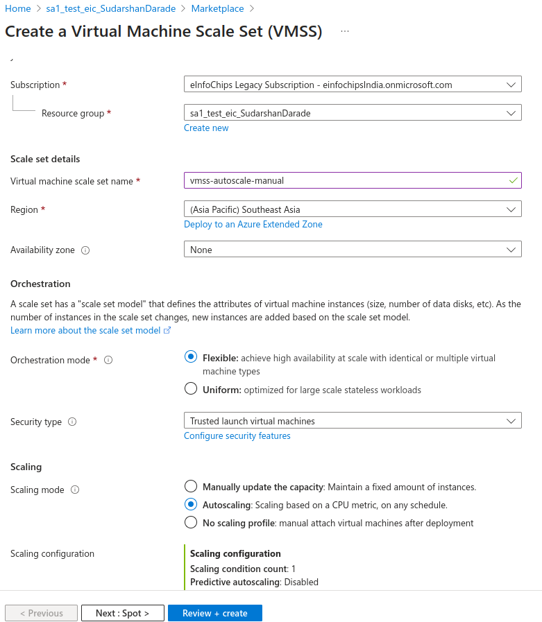
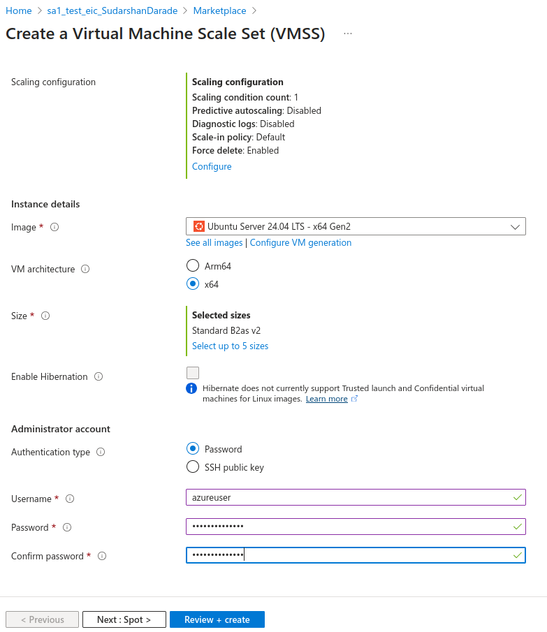
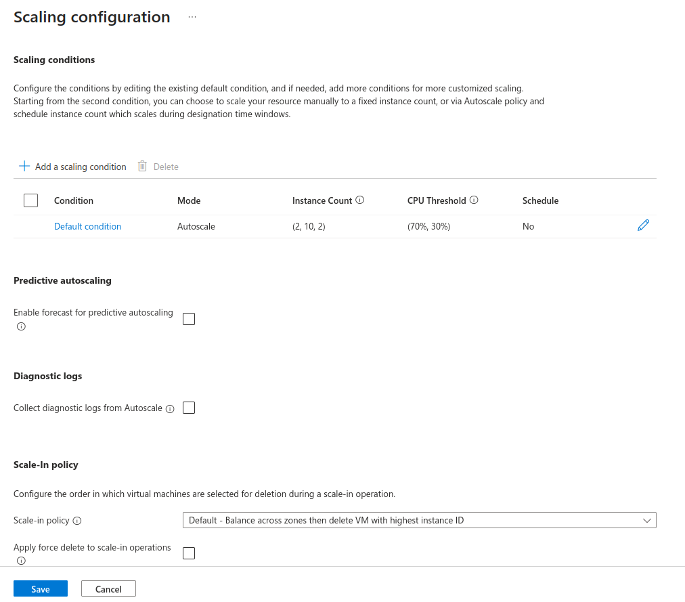
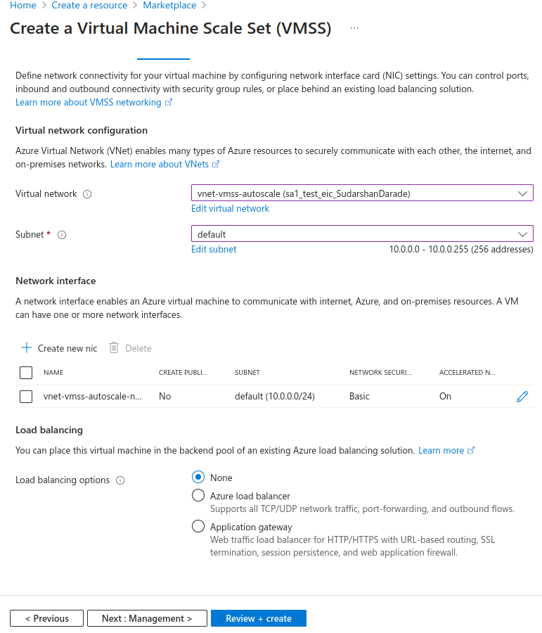
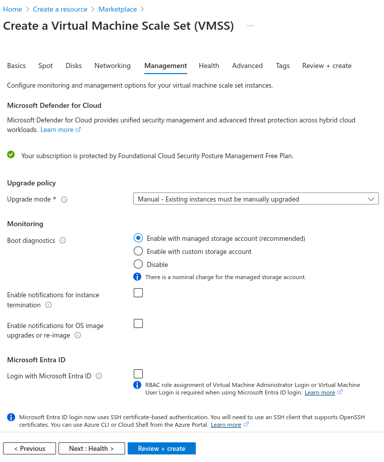
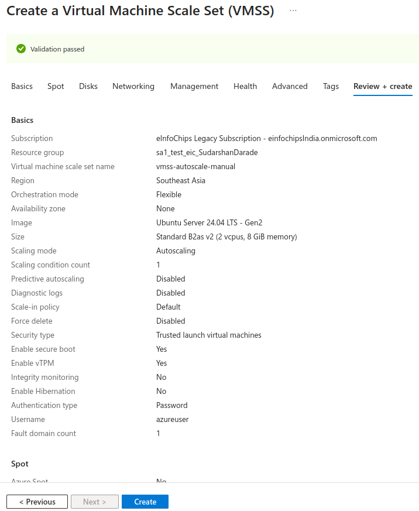
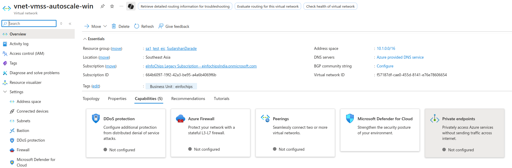
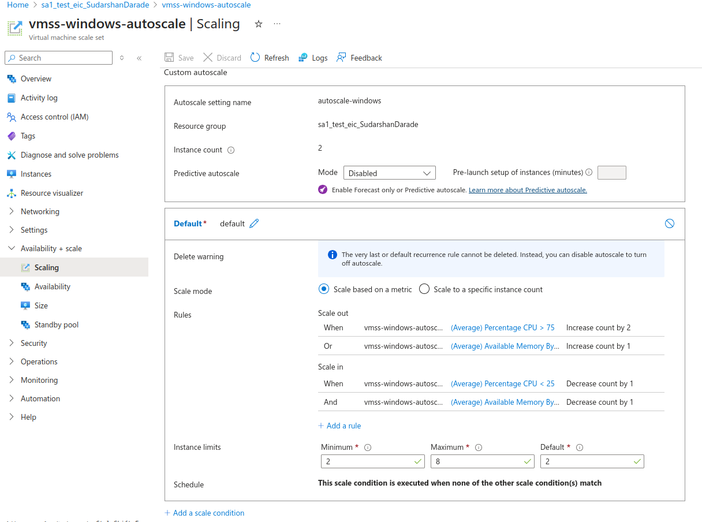

# Azure Virtual Machine Scale Sets with Auto Scaling and Flexible Orchestration

This guide covers creating and managing Virtual Machine Scale Sets (VMSS) using flexible orchestration mode with auto scaling for both Linux and Windows VMs.

## Overview

Azure VMSS with flexible orchestration and auto scaling provides:
- **Automatic Scaling**: Scale based on metrics and schedules
- **Cost Optimization**: Scale down during low demand
- **Performance Management**: Scale up during high demand
- **Mixed Instance Types**: Different VM sizes in same scale set

---
## Prerequisites

- Active Microsoft Azure account
- Azure CLI installed
- SSH key pair for Linux VMs
- Understanding of scaling metrics

---
## Manual VMSS Creation with Auto Scaling

### Azure Portal Steps

#### 1. Create VMSS via Portal
1. Navigate to **Virtual machine scale sets** > **Create**
2. **Basics Tab:**
   - Resource group: `sa1_test_eic_SudarshanDarade`
   - Scale set name: `vmss-autoscale-manual`
   - Region: `SouthEast Asia`
   - Orchestration mode: **Flexible**
   - Image: `Ubuntu 24.04 LTS`
   - Size: `Standard_B2s`
   - Authentication: SSH public key
   - Username: `azureuser`




3. **Scaling Tab:**
   - Initial instance count: `2`
   - Scaling policy: **Custom**
   - Enable autoscale: **Yes**
   - Minimum instances: `2`
   - Maximum instances: `10`
   - Scale out CPU threshold: `70%`
   - Scale in CPU threshold: `30%`



4. **Networking Tab:**
   - Virtual network: Create new `vnet-vmss-autoscale`
   - Subnet: Create new `subnet-vmss` (10.0.1.0/24)
   


5. **Management Tab:**
   - Upgrade policy: `Automatic`
   - Enable system assigned managed identity: `Yes`



6. Click **Review + Create** > **Create**



#### 2. Configure Auto Scale Rules via Portal

**Add Scale Rules:**
1. Navigate to your VMSS
2. Go to **Settings** > **Scaling**
3. Click **Custom autoscale**
4. **Scale condition:**
   - Scale mode: `Scale based on a metric`
   - Rules:
     - **Scale out**: CPU > 70% for 5 minutes, increase by 1
     - **Scale in**: CPU < 30% for 5 minutes, decrease by 1
   - Instance limits: Min 2, Max 10, Default 2


#### 3. PowerShell Manual Creation with Auto Scale

```powershell
# Create resource group
New-AzResourceGroup -Name "sa1_test_eic_SudarshanDarade" -Location "SouthEast Asia"

# Create VMSS
$vmssConfig = New-AzVmssConfig -Location "SouthEast Asia" -SkuCapacity 2 -SkuName "Standard_B2s" -OrchestrationMode "Flexible"
$vmss = New-AzVmss -ResourceGroupName "sa1_test_eic_SudarshanDarade" -Name "vmss-autoscale-manual" -VirtualMachineScaleSet $vmssConfig

# Create autoscale setting
$rule1 = New-AzAutoscaleRule -MetricName "Percentage CPU" -MetricResourceId $vmss.Id -Operator GreaterThan -MetricStatistic Average -Threshold 70 -TimeGrain 00:01:00 -TimeWindow 00:05:00 -ScaleActionCooldown 00:05:00 -ScaleActionDirection Increase -ScaleActionValue 1

$rule2 = New-AzAutoscaleRule -MetricName "Percentage CPU" -MetricResourceId $vmss.Id -Operator LessThan -MetricStatistic Average -Threshold 30 -TimeGrain 00:01:00 -TimeWindow 00:05:00 -ScaleActionCooldown 00:05:00 -ScaleActionDirection Decrease -ScaleActionValue 1

$profile = New-AzAutoscaleProfile -DefaultCapacity 2 -MaximumCapacity 10 -MinimumCapacity 2 -Rule $rule1, $rule2 -Name "Default"

Add-AzAutoscaleSetting -Location "SouthEast Asia" -Name "autoscale-manual" -ResourceGroupName "sa1_test_eic_SudarshanDarade" -TargetResourceId $vmss.Id -AutoscaleProfile $profile
```

---

## Linux VMSS with Auto Scaling

### 1. Create Resource Group and Prerequisites

```bash
# Create resource group
az group create \
  --name sa1_test_eic_SudarshanDarade \
  --location southeastasia

# Generate SSH key if not exists
ssh-keygen -t rsa -b 4096 -f ~/.ssh/vmss-autoscale-key -N ""
```

### 2. Create Virtual Network

```bash
# Create virtual network
az network vnet create \
  --resource-group sa1_test_eic_SudarshanDarade \
  --name vnet-vmss-autoscale \
  --address-prefix 10.0.0.0/16 \
  --subnet-name subnet-vmss \
  --subnet-prefix 10.0.1.0/24
```

### 3. Create Linux VMSS with Flexible Orchestration

```bash
# Create Linux VMSS
az vmss create \
  --resource-group sa1_test_eic_SudarshanDarade \
  --name vmss-linux-autoscale \
  --image Ubuntu2204 \
  --admin-username azureuser \
  --ssh-key-values ~/.ssh/vmss-autoscale-key.pub \
  --instance-count 2 \
  --vm-sku Standard_B2s \
  --vnet-name vnet-vmss-autoscale \
  --subnet subnet-vmss \
  --orchestration-mode Flexible \
  --platform-fault-domain-count 1 \
  --zones 1 2 3 \
  --upgrade-policy-mode Automatic
```

### 4. Configure Web Server on Linux Instances

```bash
# Apply custom script extension to install stress tool and web server
az vmss extension set \
  --resource-group sa1_test_eic_SudarshanDarade \
  --vmss-name vmss-linux-autoscale \
  --name customScript \
  --publisher Microsoft.Azure.Extensions \
  --version 2.1 \
  --settings '{"commandToExecute":"apt-get update && apt-get install -y nginx stress && systemctl start nginx && systemctl enable nginx && echo \"<h1>Linux VMSS Instance: $(hostname)</h1><p>Zone: $(curl -s -H Metadata:true http://169.254.169.254/metadata/instance/compute/zone?api-version=2021-02-01)</p><p>CPU Load Test: <a href=/stress>Start Stress Test</a></p>\" > /var/www/html/index.html"}'
```

### 5. Create Auto Scale Settings for Linux VMSS

```bash
# Create auto scale profile
az monitor autoscale create \
  --resource-group sa1_test_eic_SudarshanDarade \
  --resource vmss-linux-autoscale \
  --resource-type Microsoft.Compute/virtualMachineScaleSets \
  --name autoscale-linux \
  --min-count 2 \
  --max-count 10 \
  --count 2

# Create scale-out rule (CPU > 70%)
az monitor autoscale rule create \
  --resource-group sa1_test_eic_SudarshanDarade \
  --autoscale-name autoscale-linux \
  --condition "Percentage CPU > 70 avg 5m" \
  --scale out 1

# Create scale-in rule (CPU < 30%)
az monitor autoscale rule create \
  --resource-group sa1_test_eic_SudarshanDarade \
  --autoscale-name autoscale-linux \
  --condition "Percentage CPU < 30 avg 5m" \
  --scale in 1
```

---

## Windows VMSS with Auto Scaling

### 1. Create Resource Group and Prerequisites

```bash
# Create resource group
az group create \
  --name sa1_test_eic_SudarshanDarade \
  --location southeastasia
```

### 2. Create Virtual Network

```bash
# Create virtual network
az network vnet create \
  --resource-group sa1_test_eic_SudarshanDarade \
  --name vnet-vmss-autoscale-win \
  --address-prefix 10.1.0.0/16 \
  --subnet-name subnet-vmss-win \
  --subnet-prefix 10.1.1.0/24
```

### 3. Create Windows VMSS with Flexible Orchestration

```bash
# Create Windows VMSS
az vmss create \
  --resource-group sa1_test_eic_SudarshanDarade \
  --name vmss-windows-autoscale \
  --image Win2022Datacenter \
  --admin-username azureuser \
  --admin-password 'P@ssw0rd123!' \
  --instance-count 2 \
  --vm-sku Standard_B2s \
  --vnet-name vnet-vmss-autoscale-win \
  --subnet subnet-vmss-win \
  --orchestration-mode Flexible \
  --platform-fault-domain-count 1 \
  --zones 1 2 3 \
  --upgrade-policy-mode Automatic
```


### 4. Configure IIS on Windows Instances

```bash
# Apply custom script extension to install IIS
az vmss extension set \
  --resource-group sa1_test_eic_SudarshanDarade \
  --vmss-name vmss-windows-autoscale \
  --name CustomScriptExtension \
  --publisher Microsoft.Compute \
  --version 1.10 \
  --settings '{"commandToExecute":"powershell -ExecutionPolicy Unrestricted Install-WindowsFeature -name Web-Server -IncludeManagementTools; $hostname = $env:COMPUTERNAME; $zone = (Invoke-RestMethod -Uri \"http://169.254.169.254/metadata/instance/compute/zone?api-version=2021-02-01\" -Headers @{\"Metadata\"=\"true\"}); $html = \"<html><body><h1>Windows VMSS Instance: $hostname</h1><p>Zone: $zone</p><p>CPU Load Test: <a href=stress.html>Start Stress Test</a></p></body></html>\"; $html | Out-File -FilePath \"C:\\inetpub\\wwwroot\\index.html\" -Encoding UTF8"}'
```

### 5. Create Auto Scale Settings for Windows VMSS

```bash
# Create auto scale profile
az monitor autoscale create \
  --resource-group sa1_test_eic_SudarshanDarade \
  --resource vmss-windows-autoscale \
  --resource-type Microsoft.Compute/virtualMachineScaleSets \
  --name autoscale-windows \
  --min-count 2 \
  --max-count 8 \
  --count 2

# Create scale-out rule (CPU > 75%)
az monitor autoscale rule create \
  --resource-group sa1_test_eic_SudarshanDarade \
  --autoscale-name autoscale-windows \
  --condition "Percentage CPU > 75 avg 5m" \
  --scale out 2

# Create scale-in rule (CPU < 25%)
az monitor autoscale rule create \
  --resource-group sa1_test_eic_SudarshanDarade \
  --autoscale-name autoscale-windows \
  --condition "Percentage CPU < 25 avg 5m" \
  --scale in 1
```

---

## Advanced Auto Scaling Rules

### Memory-Based Scaling

```bash
# Add memory-based scale-out rule for Linux
az monitor autoscale rule create \
  --resource-group sa1_test_eic_SudarshanDarade \
  --autoscale-name autoscale-linux \
  --condition "Available Memory Bytes < 1073741824 avg 5m" \
  --scale out 1

# Add memory-based scale-in rule for Linux
az monitor autoscale rule create \
  --resource-group sa1_test_eic_SudarshanDarade \
  --autoscale-name autoscale-linux \
  --condition "Available Memory Bytes > 2147483648 avg 10m" \
  --scale in 1
```

### Network-Based Scaling

```bash
# Add network-based scaling for high traffic
az monitor autoscale rule create \
  --resource-group sa1_test_eic_SudarshanDarade \
  --autoscale-name autoscale-linux \
  --condition "Network In Total > 10485760 avg 5m" \
  --scale out 1

az monitor autoscale rule create \
  --resource-group sa1_test_eic_SudarshanDarade \
  --autoscale-name autoscale-linux \
  --condition "Network In Total < 1048576 avg 10m" \
  --scale in 1
```

### Schedule-Based Scaling

```bash
# Create weekday business hours profile (9 AM - 6 PM)
az monitor autoscale profile create \
  --resource-group sa1_test_eic_SudarshanDarade \
  --autoscale-name autoscale-linux \
  --name "business-hours" \
  --min-count 4 \
  --max-count 15 \
  --count 4 \
  --timezone "Eastern Standard Time" \
  --start "2024-01-01T09:00:00" \
  --end "2024-12-31T18:00:00" \
  --recurrence week mon tue wed thu fri

# Create weekend profile
az monitor autoscale profile create \
  --resource-group sa1_test_eic_SudarshanDarade \
  --autoscale-name autoscale-linux \
  --name "weekend" \
  --min-count 1 \
  --max-count 5 \
  --count 1 \
  --timezone "Eastern Standard Time" \
  --start "2024-01-01T00:00:00" \
  --end "2024-12-31T23:59:59" \
  --recurrence week sat sun
```

---

## Monitoring Auto Scaling

### Check Auto Scale Status

```bash
# Get auto scale settings
az monitor autoscale show \
  --resource-group sa1_test_eic_SudarshanDarade \
  --name autoscale-linux \
  --query "{Name:name, MinCount:profiles[0].capacity.minimum, MaxCount:profiles[0].capacity.maximum, CurrentCount:profiles[0].capacity.default}"

# List all auto scale rules
az monitor autoscale rule list \
  --resource-group sa1_test_eic_SudarshanDarade \
  --autoscale-name autoscale-linux \
  --output table
```

### View Scaling History

```bash
# Get scaling activity logs
az monitor activity-log list \
  --resource-group sa1_test_eic_SudarshanDarade \
  --start-time 2024-01-01T00:00:00Z \
  --query "[?contains(operationName.value, 'Scale')]" \
  --output table

# Get current instance count
az vmss show \
  --resource-group sa1_test_eic_SudarshanDarade \
  --name vmss-linux-autoscale \
  --query "sku.capacity"
```

### Monitor Metrics

```bash
# Get CPU metrics
az monitor metrics list \
  --resource /subscriptions/{subscription-id}/resourceGroups/sa1_test_eic_SudarshanDarade/providers/Microsoft.Compute/virtualMachineScaleSets/vmss-linux-autoscale \
  --metric "Percentage CPU" \
  --interval PT5M \
  --start-time 2024-01-01T00:00:00Z \
  --end-time 2024-01-01T23:59:59Z

# Get memory metrics
az monitor metrics list \
  --resource /subscriptions/{subscription-id}/resourceGroups/sa1_test_eic_SudarshanDarade/providers/Microsoft.Compute/virtualMachineScaleSets/vmss-linux-autoscale \
  --metric "Available Memory Bytes" \
  --interval PT5M
```

---

## Testing Auto Scaling

### Generate CPU Load on Linux

```bash
# SSH into Linux instance and generate CPU load
ssh -i ~/.ssh/vmss-autoscale-key azureuser@<instance-ip>

# Install stress tool if not already installed
sudo apt-get update && sudo apt-get install -y stress

# Generate CPU load for 10 minutes
stress --cpu 4 --timeout 600s

# Monitor scaling in another terminal
watch -n 30 "az vmss list-instances --resource-group sa1_test_eic_SudarshanDarade --name vmss-linux-autoscale --output table"
```

### Generate CPU Load on Windows

```powershell
# RDP into Windows instance and run PowerShell
# Generate CPU load using PowerShell
$jobs = @()
for ($i = 1; $i -le 4; $i++) {
    $jobs += Start-Job -ScriptBlock {
        $end = (Get-Date).AddMinutes(10)
        while ((Get-Date) -lt $end) {
            $result = 1
            for ($j = 1; $j -le 1000000; $j++) {
                $result = $result * $j / $j
            }
        }
    }
}

# Wait for jobs to complete
$jobs | Wait-Job
$jobs | Remove-Job
```

### Automated Load Testing Script

```bash
#!/bin/bash
# Automated load testing for Linux VMSS

RESOURCE_GROUP="sa1_test_eic_SudarshanDarade"
VMSS_NAME="vmss-linux-autoscale"

echo "Starting load test..."

# Get instance IPs
INSTANCE_IPS=$(az vmss list-instance-public-ips \
  --resource-group $RESOURCE_GROUP \
  --name $VMSS_NAME \
  --query "[].ipAddress" -o tsv)

# Generate load on all instances
for ip in $INSTANCE_IPS; do
  echo "Generating load on instance: $ip"
  ssh -i ~/.ssh/vmss-autoscale-key -o StrictHostKeyChecking=no azureuser@$ip \
    "nohup stress --cpu 2 --timeout 600s > /dev/null 2>&1 &" &
done

# Monitor scaling for 15 minutes
for i in {1..30}; do
  echo "Check $i/30:"
  az vmss show \
    --resource-group $RESOURCE_GROUP \
    --name $VMSS_NAME \
    --query "sku.capacity" \
    --output tsv
  sleep 30
done
```

---

## Custom Metrics and Scaling

### Application-Specific Metrics

```bash
# Create custom metric-based scaling rule
az monitor autoscale rule create \
  --resource-group sa1_test_eic_SudarshanDarade \
  --autoscale-name autoscale-linux \
  --condition "Requests per second > 100 avg 3m" \
  --scale out 2 \
  --source /subscriptions/{subscription-id}/resourceGroups/sa1_test_eic_SudarshanDarade/providers/Microsoft.Insights/components/app-insights

# Scale based on queue length
az monitor autoscale rule create \
  --resource-group sa1_test_eic_SudarshanDarade \
  --autoscale-name autoscale-linux \
  --condition "ApproximateMessageCount > 50 avg 5m" \
  --scale out 1 \
  --source /subscriptions/{subscription-id}/resourceGroups/sa1_test_eic_SudarshanDarade/providers/Microsoft.ServiceBus/namespaces/sb-namespace/queues/work-queue
```

---

## Best Practices

### Scaling Configuration

1. **Minimum Instances**: Set minimum to handle base load
2. **Maximum Instances**: Set reasonable maximum to control costs
3. **Scale-out Threshold**: Lower threshold for faster response
4. **Scale-in Threshold**: Higher threshold to prevent flapping
5. **Cool-down Periods**: Allow time for metrics to stabilize

### Optimized Auto Scale Settings

```bash
# Create optimized auto scale profile
az monitor autoscale create \
  --resource-group sa1_test_eic_SudarshanDarade \
  --resource vmss-linux-autoscale \
  --resource-type Microsoft.Compute/virtualMachineScaleSets \
  --name autoscale-optimized \
  --min-count 2 \
  --max-count 20 \
  --count 3

# Aggressive scale-out for performance
az monitor autoscale rule create \
  --resource-group sa1_test_eic_SudarshanDarade \
  --autoscale-name autoscale-optimized \
  --condition "Percentage CPU > 60 avg 3m" \
  --scale out 3 \
  --cooldown 5

# Conservative scale-in for stability
az monitor autoscale rule create \
  --resource-group sa1_test_eic_SudarshanDarade \
  --autoscale-name autoscale-optimized \
  --condition "Percentage CPU < 20 avg 15m" \
  --scale in 1 \
  --cooldown 10
```

---

## Troubleshooting

### Common Issues

1. **Scaling Not Triggered**: Check metric thresholds and time windows
2. **Slow Scaling**: Reduce evaluation time and cool-down periods
3. **Cost Overruns**: Set appropriate maximum instance limits
4. **Flapping**: Increase cool-down periods and threshold differences

### Diagnostic Commands

```bash
# Check auto scale configuration
az monitor autoscale show \
  --resource-group sa1_test_eic_SudarshanDarade \
  --name autoscale-linux

# View scaling events
az monitor activity-log list \
  --resource-group sa1_test_eic_SudarshanDarade \
  --caller "Microsoft.Insights/autoscaleSettings" \
  --start-time 2024-01-01T00:00:00Z

# Check current metrics
az monitor metrics list \
  --resource /subscriptions/{subscription-id}/resourceGroups/sa1_test_eic_SudarshanDarade/providers/Microsoft.Compute/virtualMachineScaleSets/vmss-linux-autoscale \
  --metric "Percentage CPU" \
  --interval PT1M \
  --aggregation Average
```

---

## Cleanup

```bash
# Delete Linux auto scale resources
az group delete --name sa1_test_eic_SudarshanDarade --yes --no-wait

# Delete Windows auto scale resources
az group delete --name sa1_test_eic_SudarshanDarade --yes --no-wait
```

---

## Summary

This guide covered:
- Creating VMSS with flexible orchestration and auto scaling
- Configuring CPU, memory, and network-based scaling rules
- Schedule-based scaling for predictable workloads
- Custom metrics integration for application-specific scaling
- Load testing and monitoring scaling behavior
- Best practices for production auto scaling deployments

Auto scaling with flexible orchestration provides optimal resource utilization while maintaining application performance and controlling costs.