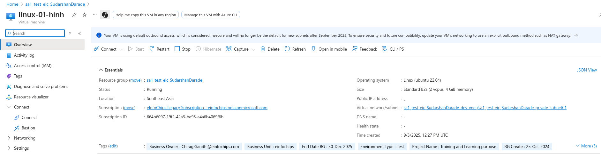
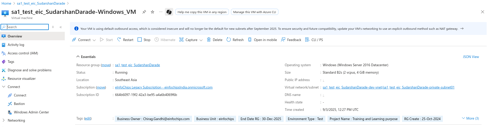
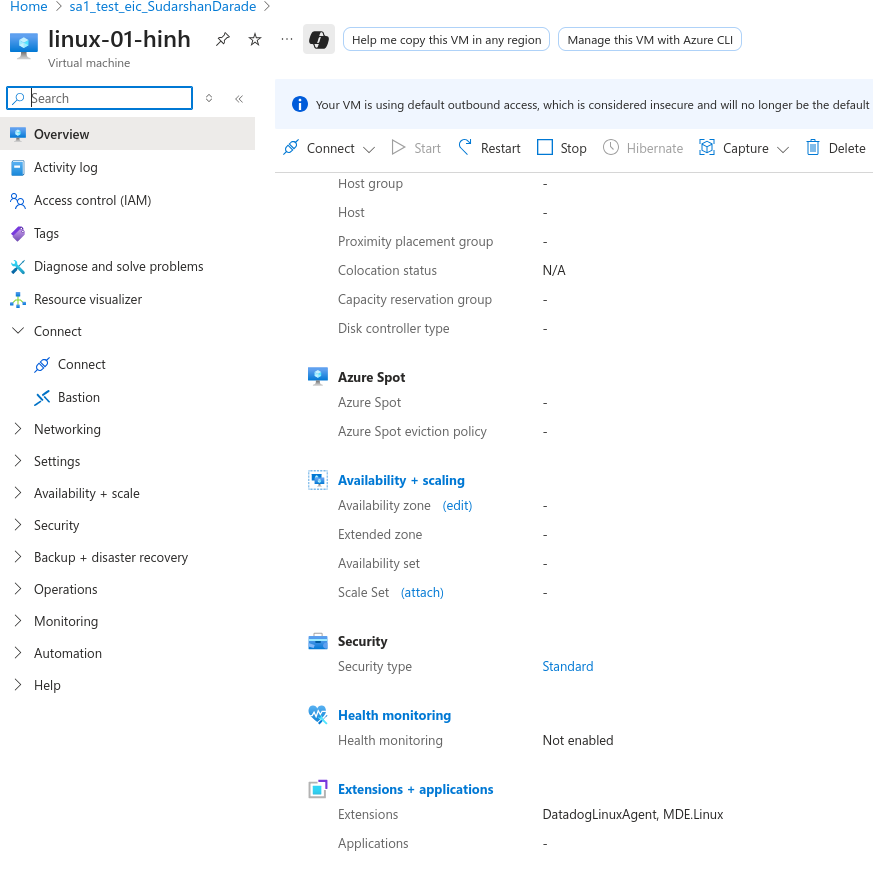
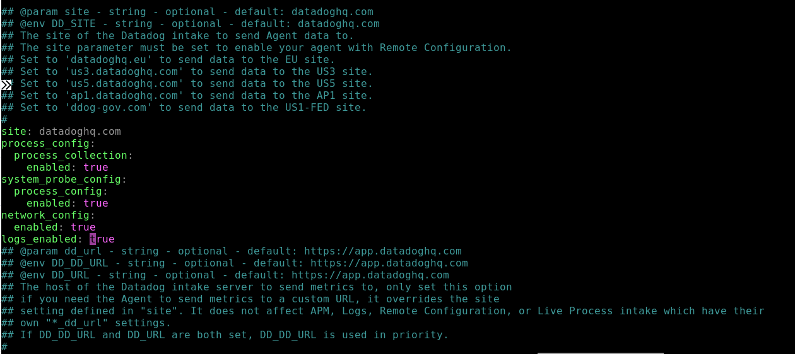
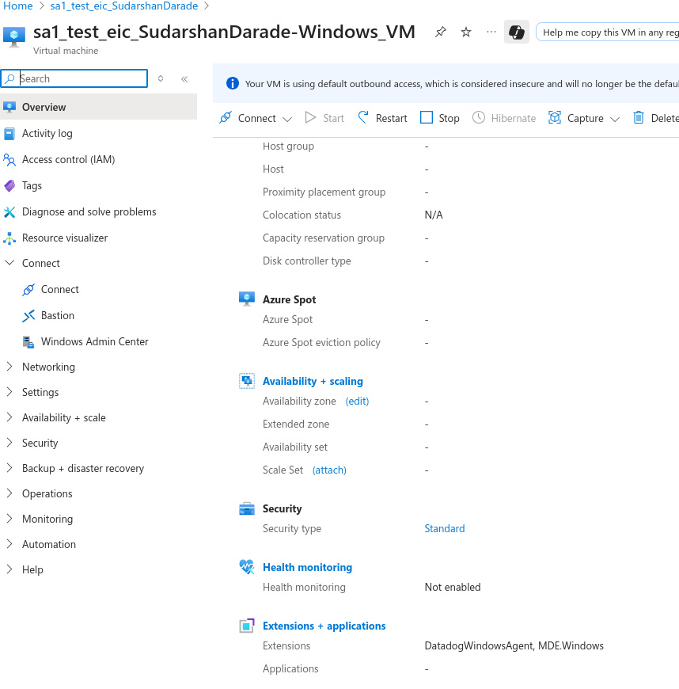
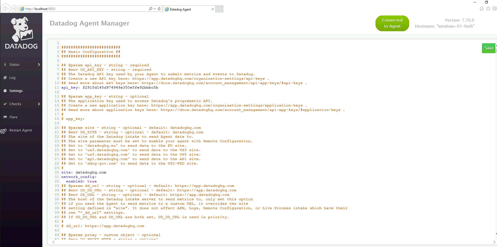
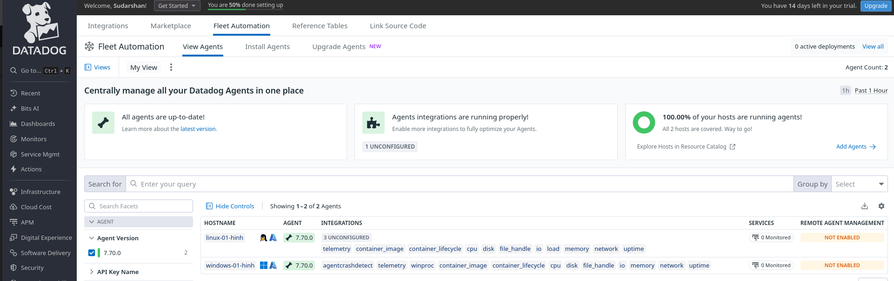

# Task-DataDog-01: DataDog Agent Installation and Configuration

## Overview

DataDog is a comprehensive monitoring and analytics platform that provides real-time visibility into your infrastructure, applications, and logs. The DataDog Agent is a lightweight software that runs on your hosts to collect metrics, traces, and logs.

## Prerequisites

- Azure subscription with VM creation permissions
- DataDog account (free trial available at https://www.datadoghq.com/)
- DataDog API key from your account
- Linux VM (Ubuntu 20.04/22.04) and Windows VM (Windows Server 2019/2022) on Azure

## Part 1: DataDog Account Setup

### Step 1: Create DataDog Account
1. Visit https://www.datadoghq.com/ and sign up for a free trial
2. Complete account verification
3. Navigate to **Organization Settings** → **API Keys**
4. Copy your API key (keep it secure)

### Step 2: Get Installation Commands
1. Go to **Integrations** → **Agent**
2. Select your operating system
3. Copy the installation commands provided

## Part 2: Azure VM Setup

### Step 1: Create Linux VM
```bash
# Create resource group
az group create --name sa1_test_eic_SudarshanDarade --location southeastasia

# Create Linux VM
az vm create \
  --resource-group sa1_test_eic_SudarshanDarade \
  --name vm-linux-datadog \
  --image Ubuntu2204 \
  --admin-username azureuser \
  --generate-ssh-keys \
  --size Standard_B2s \
  --public-ip-sku Standard
```


### Step 2: Create Windows VM
```bash
# Create Windows VM
az vm create \
  --resource-group sa1_test_eic_SudarshanDarade \
  --name vm-windows-datadog \
  --image Win2022Datacenter \
  --admin-username azureuser \
  --admin-password 'ComplexPassword123!' \
  --size Standard_B2s \
  --public-ip-sku Standard
```


### Step 3: Configure Network Security Groups
```bash
# Allow DataDog agent communication (outbound HTTPS)
az network nsg rule create \
  --resource-group sa1_test_eic_SudarshanDarade \
  --nsg-name vm-linux-datadogNSG \
  --name AllowDataDogOutbound \
  --priority 1000 \
  --direction Outbound \
  --access Allow \
  --protocol Tcp \
  --destination-port-ranges 443
```

## Part 3: DataDog Agent Installation - Linux

### Step 1: Connect to Linux VM
```bash
# Get public IP
az vm show -d -g sa1_test_eic_SudarshanDarade -n vm-linux-datadog --query publicIps -o tsv

# SSH to VM
ssh azureuser@<PUBLIC_IP>
```

### Step 2: Install DataDog Agent
```bash
# Method 1: One-line installation (replace YOUR_API_KEY)
DD_API_KEY=<YOUR_API_KEY> DD_SITE="datadoghq.com" bash -c "$(curl -L https://s3.amazonaws.com/dd-agent/scripts/install_script.sh)"

# Method 2: Manual installation
# Add DataDog repository
sudo apt-get update
sudo apt-get install apt-transport-https curl gnupg
sudo sh -c "echo 'deb [signed-by=/usr/share/keyrings/datadog-archive-keyring.gpg] https://apt.datadoghq.com/ stable 7' > /etc/apt/sources.list.d/datadog.list"
sudo touch /usr/share/keyrings/datadog-archive-keyring.gpg
sudo chmod a+r /usr/share/keyrings/datadog-archive-keyring.gpg
curl https://keys.datadoghq.com/DATADOG_APT_KEY_CURRENT.public | sudo gpg --no-default-keyring --keyring /usr/share/keyrings/datadog-archive-keyring.gpg --import --batch
curl https://keys.datadoghq.com/DATADOG_APT_KEY_382E94DE.public | sudo gpg --no-default-keyring --keyring /usr/share/keyrings/datadog-archive-keyring.gpg --import --batch
curl https://keys.datadoghq.com/DATADOG_APT_KEY_F14F620E.public | sudo gpg --no-default-keyring --keyring /usr/share/keyrings/datadog-archive-keyring.gpg --import --batch

# Install agent
sudo apt-get update
sudo apt-get install datadog-agent
```

### Step 3: Configure DataDog Agent
```bash
# Copy configuration template
sudo cp /etc/datadog-agent/datadog.yaml.example /etc/datadog-agent/datadog.yaml

# Edit configuration
sudo nano /etc/datadog-agent/datadog.yaml
```


**Key configuration settings:**
```yaml
# /etc/datadog-agent/datadog.yaml
api_key: <YOUR_API_KEY>
site: datadoghq.com
hostname: vm-linux-datadog
tags:
  - env:production
  - team:infrastructure
  - cloud:azure
  - region:southeastasia

# Enable process monitoring
process_config:
  enabled: "true"

# Enable network monitoring
network_config:
  enabled: true

# Enable logs collection
logs_enabled: true
```


### Step 4: Start and Enable Agent
```bash
# Start DataDog agent
sudo systemctl start datadog-agent

# Enable auto-start
sudo systemctl enable datadog-agent

# Check status
sudo systemctl status datadog-agent

# Verify agent status
sudo datadog-agent status
```

## Part 4: DataDog Agent Installation - Windows

### Step 1: Connect to Windows VM
```bash
# Get public IP
az vm show -d -g sa1_test_eic_SudarshanDarade -n vm-windows-datadog --query publicIps -o tsv

# Use RDP to connect (or Azure Bastion)
```

### Step 2: Install DataDog Agent via PowerShell
```powershell
# Run PowerShell as Administrator

# Method 1: Direct download and install
$apiKey = "<YOUR_API_KEY>"
$msiUrl = "https://s3.amazonaws.com/ddagent-windows-stable/datadog-agent-7-latest.amd64.msi"
$msiPath = "$env:TEMP\datadog-agent.msi"

# Download installer
Invoke-WebRequest -Uri $msiUrl -OutFile $msiPath

# Install with API key
Start-Process msiexec.exe -ArgumentList "/i $msiPath /quiet APIKEY=$apiKey" -Wait

# Method 2: Using Chocolatey
Set-ExecutionPolicy Bypass -Scope Process -Force
[System.Net.ServicePointManager]::SecurityProtocol = [System.Net.ServicePointManager]::SecurityProtocol -bor 3072
iex ((New-Object System.Net.WebClient).DownloadString('https://chocolatey.org/install.ps1'))

# Install DataDog agent
choco install datadog-agent -y --params="'/APIKEY:<YOUR_API_KEY>'"
```


### Step 3: Configure Windows Agent
```powershell
# Navigate to DataDog directory
cd "C:\ProgramData\Datadog"

# Copy configuration template
Copy-Item "datadog.yaml.example" "datadog.yaml"

# Edit configuration file
notepad datadog.yaml
```

**Windows configuration:**
```yaml
# C:\ProgramData\Datadog\datadog.yaml
api_key: <YOUR_API_KEY>
site: datadoghq.com
hostname: vm-windows-datadog
tags:
  - env:production
  - team:infrastructure
  - cloud:azure
  - region:southeastasia
  - os:windows

# Enable process monitoring
process_config:
  enabled: "true"

# Enable logs collection
logs_enabled: true

# Windows-specific settings
win32_event_log:
  - channel_path: System
  - channel_path: Application
```


### Step 4: Start Windows Service
```powershell
# Start DataDog service
Start-Service -Name "DatadogAgent"

# Set to automatic startup
Set-Service -Name "DatadogAgent" -StartupType Automatic

# Check service status
Get-Service -Name "DatadogAgent"

# Verify agent status
& "C:\Program Files\Datadog\Datadog Agent\bin\agent.exe" status
```

## Part 5: Agent Configuration and Monitoring

### Step 1: Enable Azure Integration
```bash
# Linux: Enable Azure integration
sudo nano /etc/datadog-agent/conf.d/azure.d/conf.yaml
```

```yaml
# Azure integration configuration
init_config:

instances:
  - tenant_name: <AZURE_TENANT_ID>
    client_id: <AZURE_CLIENT_ID>
    client_secret: <AZURE_CLIENT_SECRET>
    subscription_id: <AZURE_SUBSCRIPTION_ID>
```

### Step 2: Configure Log Collection
```bash
# Linux: Configure log collection
sudo nano /etc/datadog-agent/conf.d/custom_logs.d/conf.yaml
```

```yaml
logs:
  - type: file
    path: /var/log/syslog
    service: system
    source: syslog
  - type: file
    path: /var/log/auth.log
    service: system
    source: auth
```

### Step 3: Custom Metrics Configuration
```bash
# Create custom check
sudo nano /etc/datadog-agent/checks.d/custom_check.py
```

```python
from datadog_checks.base import AgentCheck

class CustomCheck(AgentCheck):
    def check(self, instance):
        # Custom metric example
        self.gauge('custom.vm.cpu_usage', 75.0, tags=['host:vm-linux-datadog'])
        self.count('custom.vm.requests', 1, tags=['host:vm-linux-datadog'])
```

## Part 6: Verification and Monitoring

### Step 1: Verify Agent Status
```bash
# Linux
sudo datadog-agent status
sudo datadog-agent configcheck

# Windows (PowerShell)
& "C:\Program Files\Datadog\Datadog Agent\bin\agent.exe" status
& "C:\Program Files\Datadog\Datadog Agent\bin\agent.exe" configcheck
```

### Step 2: Check DataDog Dashboard
1. Login to DataDog web interface
2. Navigate to **Infrastructure** → **Host Map**
3. Verify both VMs appear in the dashboard
4. Check **Metrics** → **Explorer** for system metrics



### Step 3: Test Alerting
```bash
# Generate high CPU load for testing
# Linux
stress --cpu 4 --timeout 300s

# Windows (PowerShell)
while($true) { Get-Process | Out-Null }
```

## Part 7: Advanced Configuration

### Step 1: Enable APM (Application Performance Monitoring)
```yaml
# Add to datadog.yaml
apm_config:
  enabled: true
  env: production
```

### Step 2: Configure Network Monitoring
```yaml
# Add to datadog.yaml
network_config:
  enabled: true
```

### Step 3: Enable Security Monitoring
```yaml
# Add to datadog.yaml
runtime_security_config:
  enabled: true
```

## Part 8: Troubleshooting

### Common Issues and Solutions

1. **Agent not reporting data:**
```bash
# Check connectivity
curl -v https://api.datadoghq.com/api/v1/validate

# Check agent logs
sudo tail -f /var/log/datadog/agent.log
```

2. **Permission issues:**
```bash
# Fix permissions
sudo chown -R dd-agent:dd-agent /etc/datadog-agent/
sudo chmod 640 /etc/datadog-agent/datadog.yaml
```

3. **Windows service issues:**
```powershell
# Restart service
Restart-Service -Name "DatadogAgent"

# Check event logs
Get-EventLog -LogName Application -Source "Datadog Agent"
```

## Part 9: Monitoring Dashboards

### Step 1: Create Custom Dashboard
1. Go to **Dashboards** → **New Dashboard**
2. Add widgets for:
   - CPU utilization
   - Memory usage
   - Disk I/O
   - Network traffic
   - Process count

### Step 2: Set Up Alerts
1. Navigate to **Monitors** → **New Monitor**
2. Create alerts for:
   - High CPU usage (>80%)
   - Low disk space (<10%)
   - Memory usage (>90%)
   - Service downtime

## Part 10: Cleanup

### Remove Resources
```bash
# Delete resource group
az group delete --name sa1_test_eic_SudarshanDarade --yes --no-wait

# Uninstall DataDog agent (if needed)
# Linux
sudo apt-get remove datadog-agent

# Windows
choco uninstall datadog-agent
```

## Key Takeaways

1. **Agent Installation**: DataDog agent can be installed via one-line script or package managers
2. **Configuration**: YAML-based configuration with API key and tags
3. **Monitoring**: Real-time infrastructure and application monitoring
4. **Integration**: Native Azure integration for cloud resource monitoring
5. **Alerting**: Comprehensive alerting system with multiple notification channels
6. **Dashboards**: Customizable dashboards for different teams and use cases

## Best Practices

- Use meaningful tags for resource organization
- Enable log collection for troubleshooting
- Set up proper alerting thresholds
- Regular agent updates for security
- Monitor agent health and connectivity
- Use service discovery for dynamic environments

