# Task-SQL-03: SQL Server Virtual Machine Setup and Management

## Overview
This task covers creating SQL Server on Azure Virtual Machine, configuring firewall rules, accessing via RDP, and connecting using SQL Server Management Studio (SSMS) and Azure Data Studio.

## SQL Server on Azure VM vs Azure SQL Database

### SQL Server on Azure VM
- **Full Control**: Complete SQL Server instance control
- **Compatibility**: 100% SQL Server feature compatibility
- **Customization**: Custom configurations and third-party tools
- **Licensing**: Bring your own license or pay-as-you-go
- **Management**: Customer manages OS, SQL Server, and updates

### Azure SQL Database
- **Managed Service**: Microsoft manages infrastructure
- **Limited Control**: Restricted administrative access
- **Built-in Features**: Automatic backups, patching, monitoring
- **Scalability**: Easy scaling without downtime
- **Cost**: Pay for compute and storage only

## Task 1: Create SQL Server VM via Azure Portal

### Step 1: Create Virtual Machine
1. Navigate to Azure Portal → Create a resource
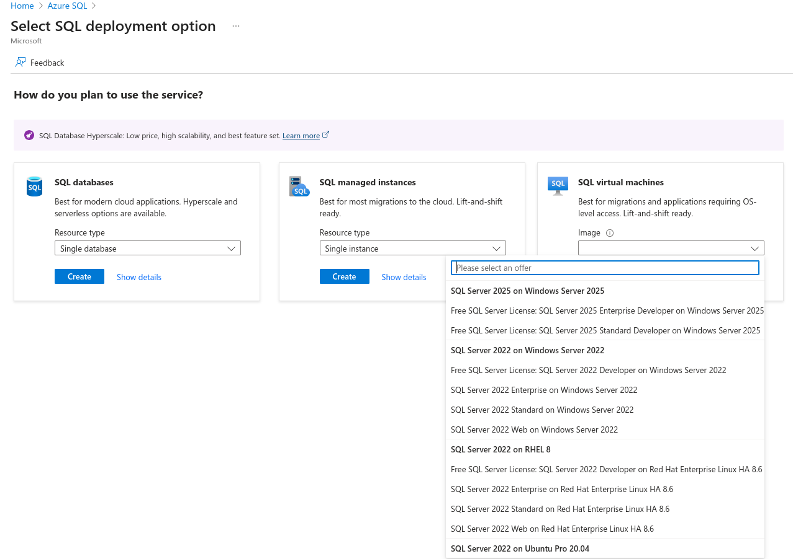
2. Search for "SQL Server" → Select "SQL Server 2025 on Windows Server 2025"
3. Configure basic settings:

   ```
   VM Name: trainingsqlvm1000
   Resource Group: sa1_test_eic_SudarshanDarade
   Region: SouthEast Asia
   Availability Options: No infrastructure redundancy required
   Image: SQL Server 2022 Developer on Windows Server 2022
   Size: Standard_B2as_v2 (2 vcpus, 8 GiB memory)
   ```
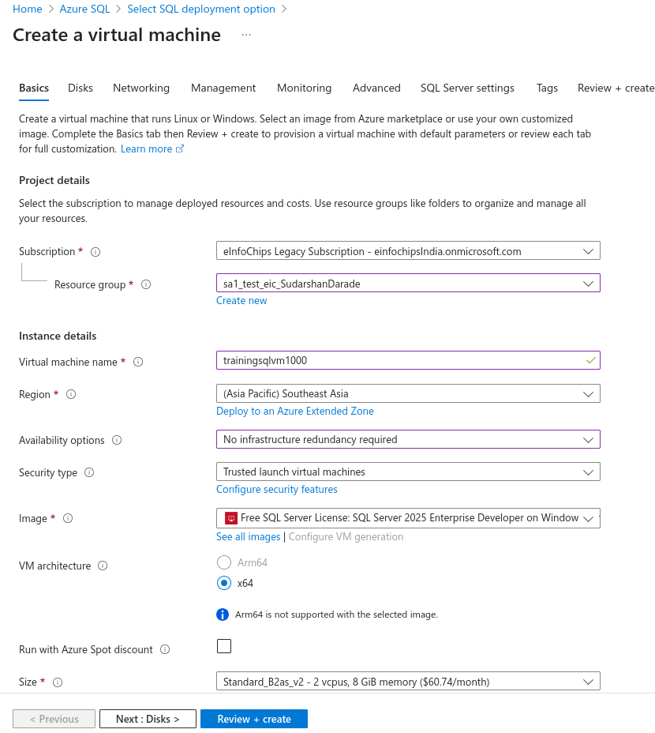

4. Configure Disks:

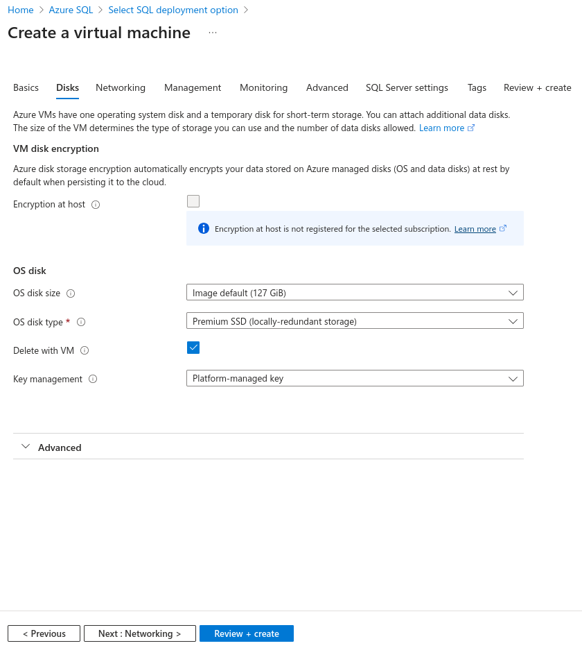

5. Configure Networking :

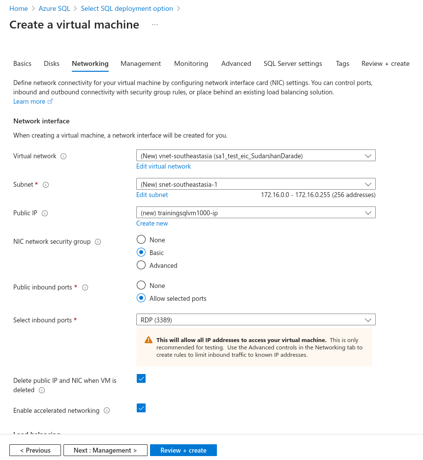

6. Configure management options : 

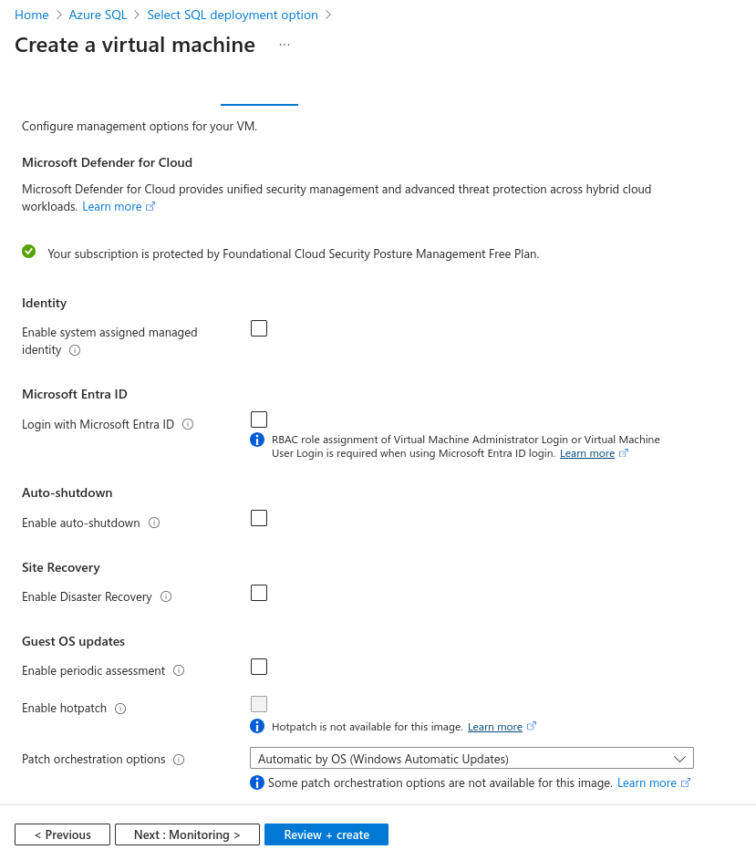

7. Configure Monitoring :

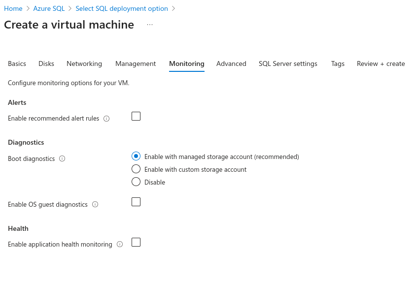

8. Configure Advanced Options:

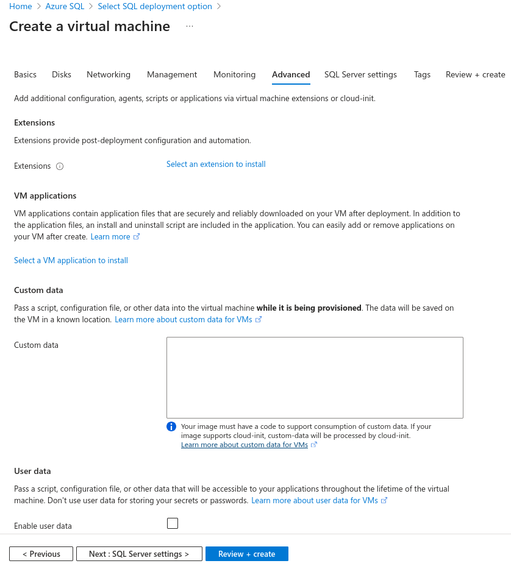

9. Configure SQL Server Settings

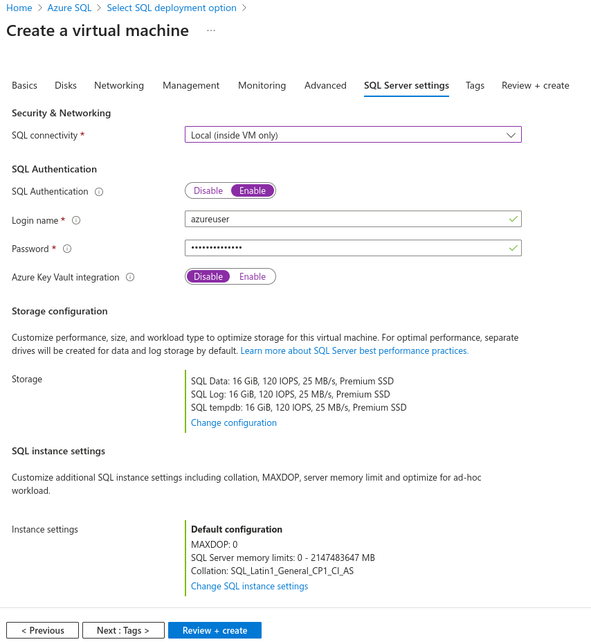

10. Review and Create the VM

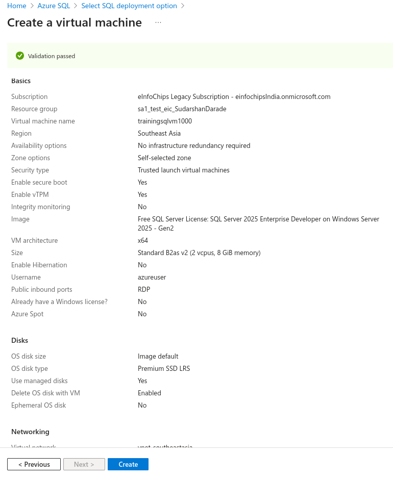

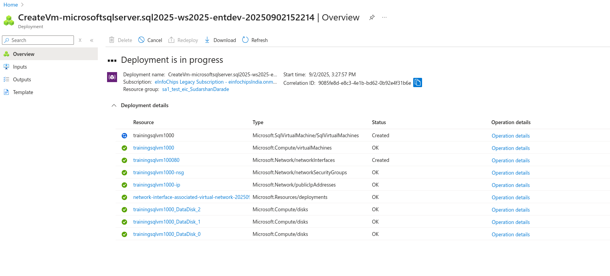


### Step 2: Administrator Account
```
Username: sqladmin
Password: P@ssw0rd123!
Confirm Password: P@ssw0rd123!
```

### Step 3: Inbound Port Rules
```
Public inbound ports: Allow selected ports
Select inbound ports: RDP (3389), HTTP (80), HTTPS (443)
```

### Step 4: SQL Server Settings
```
SQL connectivity: Public (Internet)
Port: 1433
SQL Authentication: Enable
Login name: sa
Password: P@ssw0rd123!
```


## Task 2: Create SQL Server VM via Azure CLI

### Prerequisites
```bash
# Login and set subscription
az login
az account set --subscription "your-subscription-id"

# Create resource group
az group create --name sa1_test_eic_SudarshanDarade --location southeastasia
```

### Create Virtual Network
```bash
az network vnet create \
  --resource-group sa1_test_eic_SudarshanDarade \
  --name sql-vm-vnet \
  --address-prefix 10.0.0.0/16 \
  --subnet-name sql-subnet \
  --subnet-prefix 10.0.1.0/24
```

### Create Network Security Group
```bash
az network nsg create \
  --resource-group sa1_test_eic_SudarshanDarade \
  --name sql-vm-nsg

# Allow RDP
az network nsg rule create \
  --resource-group sa1_test_eic_SudarshanDarade \
  --nsg-name sql-vm-nsg \
  --name AllowRDP \
  --protocol Tcp \
  --priority 1000 \
  --destination-port-range 3389 \
  --access Allow

# Allow SQL Server
az network nsg rule create \
  --resource-group sa1_test_eic_SudarshanDarade \
  --nsg-name sql-vm-nsg \
  --name AllowSQL \
  --protocol Tcp \
  --priority 1001 \
  --destination-port-range 1433 \
  --access Allow
```

### Create Public IP
```bash
az network public-ip create \
  --resource-group sa1_test_eic_SudarshanDarade \
  --name sql-vm-public-ip \
  --allocation-method Static \
  --sku Standard
```

### Create Network Interface
```bash
az network nic create \
  --resource-group sa1_test_eic_SudarshanDarade \
  --name sql-vm-nic \
  --vnet-name sql-vm-vnet \
  --subnet sql-subnet \
  --public-ip-address sql-vm-public-ip \
  --network-security-group sql-vm-nsg
```

### Create SQL Server VM
```bash
az vm create \
  --resource-group sa1_test_eic_SudarshanDarade \
  --name sql-vm-training \
  --nics sql-vm-nic \
  --image MicrosoftSQLServer:sql2022-ws2022:sqldev-gen2:latest \
  --size Standard_D2s_v3 \
  --admin-username sqladmin \
  --admin-password P@ssw0rd123! \
  --os-disk-size-gb 128 \
  --storage-sku Premium_LRS
```

### Configure SQL Server Settings
```bash
az sql vm create \
  --resource-group sa1_test_eic_SudarshanDarade \
  --name sql-vm-training \
  --license-type PAYG \
  --sql-mgmt-type Full \
  --connectivity-type PUBLIC \
  --port 1433 \
  --sql-auth-update-username sa \
  --sql-auth-update-pwd P@ssw0rd123!
```

## Task 3: Create SQL Server VM via PowerShell

### Prerequisites
```powershell
# Install and import Azure PowerShell
Install-Module -Name Az -AllowClobber -Scope CurrentUser
Import-Module Az
Connect-AzAccount
Set-AzContext -SubscriptionId "your-subscription-id"
```

### Create Resource Group
```powershell
New-AzResourceGroup -Name "sa1_test_eic_SudarshanDarade-ps" -Location "SouthEast Asia"
```

### Create Virtual Network
```powershell
$subnet = New-AzVirtualNetworkSubnetConfig -Name "sql-subnet" -AddressPrefix "10.0.1.0/24"
$vnet = New-AzVirtualNetwork -ResourceGroupName "sa1_test_eic_SudarshanDarade-ps" -Location "SouthEast Asia" -Name "sql-vm-vnet" -AddressPrefix "10.0.0.0/16" -Subnet $subnet
```

### Create Network Security Group
```powershell
$rdpRule = New-AzNetworkSecurityRuleConfig -Name "AllowRDP" -Protocol Tcp -Direction Inbound -Priority 1000 -SourceAddressPrefix * -SourcePortRange * -DestinationAddressPrefix * -DestinationPortRange 3389 -Access Allow
$sqlRule = New-AzNetworkSecurityRuleConfig -Name "AllowSQL" -Protocol Tcp -Direction Inbound -Priority 1001 -SourceAddressPrefix * -SourcePortRange * -DestinationAddressPrefix * -DestinationPortRange 1433 -Access Allow
$nsg = New-AzNetworkSecurityGroup -ResourceGroupName "sa1_test_eic_SudarshanDarade-ps" -Location "SouthEast Asia" -Name "sql-vm-nsg" -SecurityRules $rdpRule,$sqlRule
```

### Create Public IP and NIC
```powershell
$publicIp = New-AzPublicIpAddress -ResourceGroupName "sa1_test_eic_SudarshanDarade-ps" -Location "SouthEast Asia" -Name "sql-vm-public-ip" -AllocationMethod Static -Sku Standard
$nic = New-AzNetworkInterface -ResourceGroupName "sa1_test_eic_SudarshanDarade-ps" -Location "SouthEast Asia" -Name "sql-vm-nic" -SubnetId $vnet.Subnets[0].Id -PublicIpAddressId $publicIp.Id -NetworkSecurityGroupId $nsg.Id
```

### Create VM Configuration
```powershell
$vmConfig = New-AzVMConfig -VMName "sql-vm-training" -VMSize "Standard_D2s_v3"
$cred = Get-Credential -UserName "sqladmin" -Message "Enter VM password"
$vmConfig = Set-AzVMOperatingSystem -VM $vmConfig -Windows -ComputerName "sql-vm-training" -Credential $cred
$vmConfig = Set-AzVMSourceImage -VM $vmConfig -PublisherName "MicrosoftSQLServer" -Offer "sql2022-ws2022" -Skus "sqldev-gen2" -Version "latest"
$vmConfig = Add-AzVMNetworkInterface -VM $vmConfig -Id $nic.Id
$vmConfig = Set-AzVMOSDisk -VM $vmConfig -CreateOption FromImage -StorageAccountType Premium_LRS
```

### Create Virtual Machine
```powershell
New-AzVM -ResourceGroupName "sa1_test_eic_SudarshanDarade-ps" -Location "SouthEast Asia" -VM $vmConfig
```

## Task 4: Configure Firewall Rules

### Windows Firewall Configuration
Connect to VM via RDP and run PowerShell as Administrator:

```powershell
# Enable SQL Server port
New-NetFirewallRule -DisplayName "SQL Server" -Direction Inbound -Protocol TCP -LocalPort 1433 -Action Allow

# Enable SQL Browser (if needed)
New-NetFirewallRule -DisplayName "SQL Browser" -Direction Inbound -Protocol UDP -LocalPort 1434 -Action Allow

# Check existing rules
Get-NetFirewallRule -DisplayName "*SQL*"
```

### SQL Server Configuration Manager
1. Open SQL Server Configuration Manager
2. Navigate to SQL Server Network Configuration → Protocols for MSSQLSERVER
3. Enable TCP/IP protocol
4. Right-click TCP/IP → Properties → IP Addresses tab
5. Set TCP Port to 1433 for all IP addresses
6. Restart SQL Server service

### Azure Network Security Group Rules
```bash
# Add custom port if needed
az network nsg rule create \
  --resource-group sa1_test_eic_SudarshanDarade \
  --nsg-name sql-vm-nsg \
  --name AllowCustomPort \
  --protocol Tcp \
  --priority 1002 \
  --destination-port-range 1434 \
  --access Allow \
  --source-address-prefixes "your-ip-address/32"
```

## Task 5: Access VM via RDP

### Get VM Public IP
```bash
az vm show \
  --resource-group sa1_test_eic_SudarshanDarade \
  --name sql-vm-training \
  --show-details \
  --query publicIps \
  --output tsv
```

### Connect via RDP
1. **Windows**: Use Remote Desktop Connection
   - Computer: VM-Public-IP-Address
   - Username: sqladmin
   - Password: P@ssw0rd123!

2. **macOS**: Use Microsoft Remote Desktop
   - Download from App Store
   - Add PC with VM IP address
   - Enter credentials

3. **Linux**: Use Remmina or xfreerdp
   ```bash
   xfreerdp /v:VM-Public-IP-Address /u:sqladmin /p:P@ssw0rd123!
   ```

### RDP Connection Troubleshooting
```bash
# Check VM status
az vm get-instance-view \
  --resource-group sa1_test_eic_SudarshanDarade \
  --name sql-vm-training \
  --query instanceView.statuses

# Check NSG rules
az network nsg rule list \
  --resource-group sa1_test_eic_SudarshanDarade \
  --nsg-name sql-vm-nsg \
  --output table

# Test port connectivity
Test-NetConnection -ComputerName VM-Public-IP -Port 3389
```

## Task 6: Install and Configure SSMS

### Download and Install SSMS
1. RDP to the SQL Server VM
2. Open web browser and navigate to:
   ```
   https://docs.microsoft.com/en-us/sql/ssms/download-sql-server-management-studio-ssms
   ```
3. Download latest SSMS version
4. Run installer with default settings
5. Restart if required

### Connect to Local SQL Server
1. Open SSMS
2. Connect to Database Engine:
   ```
   Server name: localhost
   Authentication: SQL Server Authentication
   Login: sa
   Password: P@ssw0rd123!
   ```

### Connect to Remote SQL Server
1. From another machine, open SSMS
2. Connect using:
   ```
   Server name: VM-Public-IP-Address,1433
   Authentication: SQL Server Authentication
   Login: sa
   Password: P@ssw0rd123!
   ```
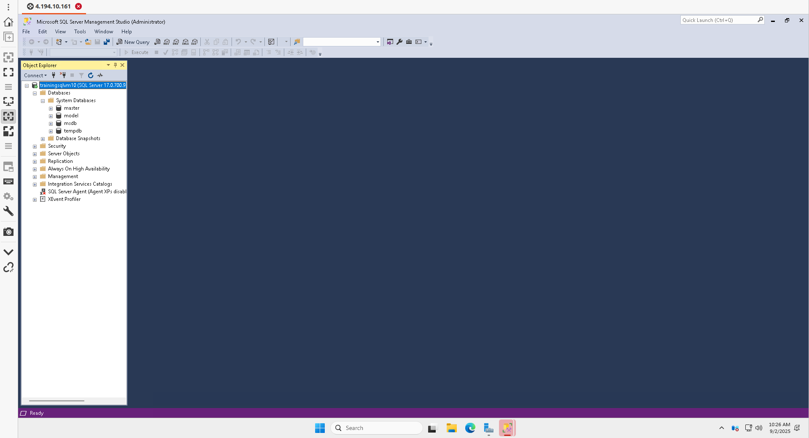

### SSMS Configuration
```sql
-- Enable remote connections
EXEC sp_configure 'remote access', 1;
RECONFIGURE;

-- Check SQL Server version
SELECT @@VERSION;

-- View server properties
SELECT 
    SERVERPROPERTY('ProductVersion') AS ProductVersion,
    SERVERPROPERTY('ProductLevel') AS ProductLevel,
    SERVERPROPERTY('Edition') AS Edition,
    SERVERPROPERTY('MachineName') AS MachineName;
```

## Task 7: Install and Configure Azure Data Studio

### Download and Install Azure Data Studio
1. Navigate to: https://docs.microsoft.com/en-us/sql/azure-data-studio/download-azure-data-studio
2. Download appropriate version for your OS
3. Install with default settings

### Connect to SQL Server VM
1. Open Azure Data Studio
2. Create new connection:
   ```
   Connection type: Microsoft SQL Server
   Server: VM-Public-IP-Address,1433
   Authentication type: SQL Login
   User name: sa
   Password: P@ssw0rd123!
   Database: <Default>
   Server group: <Default>
   Name: SQL VM Training
   ```


### Azure Data Studio Features
1. **Query Editor**: Write and execute SQL queries
2. **Object Explorer**: Browse database objects
3. **Extensions**: Install additional functionality
4. **Notebooks**: Create SQL notebooks for documentation
5. **Charts**: Visualize query results

### Install Useful Extensions
1. Open Extensions (Ctrl+Shift+X)
2. Install recommended extensions:
   - SQL Server Admin Pack
   - SQL Server Import
   - SQL Server Profiler
   - Machine Learning

## Task 8: Database Operations

### Create Sample Database
```sql
-- Create database
CREATE DATABASE SampleDB;
GO

USE SampleDB;
GO

-- Create table
CREATE TABLE Customers (
    CustomerID int IDENTITY(1,1) PRIMARY KEY,
    FirstName nvarchar(50) NOT NULL,
    LastName nvarchar(50) NOT NULL,
    Email nvarchar(100) UNIQUE,
    City nvarchar(50),
    Country nvarchar(50),
    CreatedDate datetime2 DEFAULT GETDATE()
);

-- Insert sample data
INSERT INTO Customers (FirstName, LastName, Email, City, Country)
VALUES 
    ('John', 'Doe', 'john.doe@email.com', 'New York', 'USA'),
    ('Jane', 'Smith', 'jane.smith@email.com', 'London', 'UK'),
    ('Mike', 'Johnson', 'mike.johnson@email.com', 'Toronto', 'Canada'),
    ('Sarah', 'Wilson', 'sarah.wilson@email.com', 'Sydney', 'Australia');

-- Query data
SELECT * FROM Customers;
SELECT Country, COUNT(*) as CustomerCount 
FROM Customers 
GROUP BY Country;
```

### Backup and Restore Operations
```sql
-- Create backup
BACKUP DATABASE SampleDB 
TO DISK = 'C:\Backup\SampleDB.bak'
WITH FORMAT, INIT;

-- Restore database
RESTORE DATABASE SampleDB_Restored
FROM DISK = 'C:\Backup\SampleDB.bak'
WITH MOVE 'SampleDB' TO 'C:\Data\SampleDB_Restored.mdf',
     MOVE 'SampleDB_Log' TO 'C:\Data\SampleDB_Restored.ldf',
     REPLACE;
```
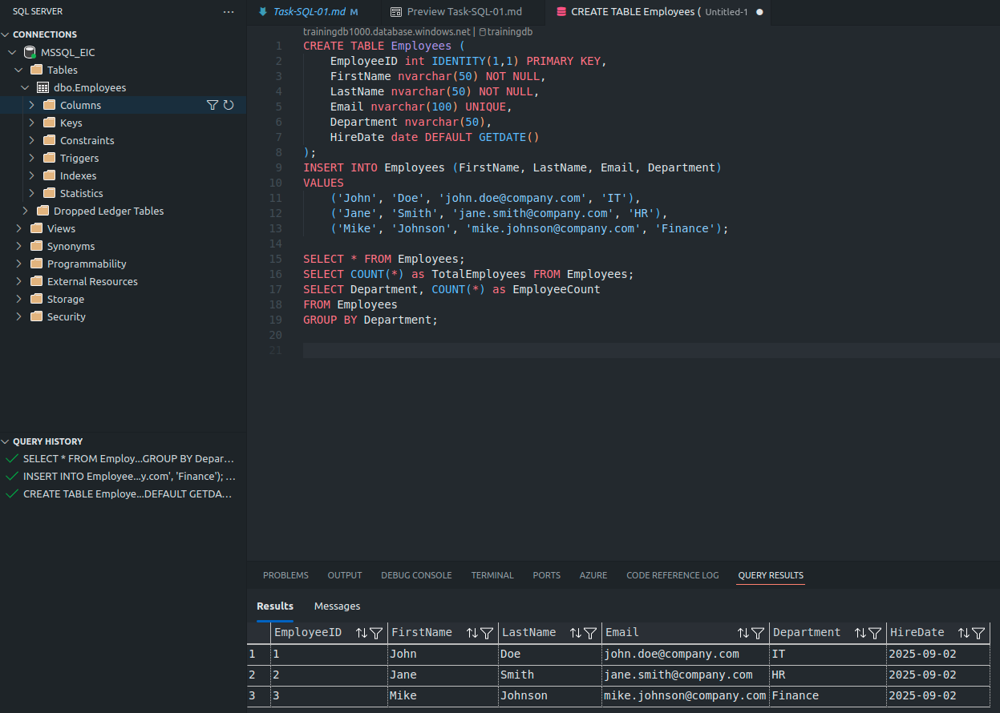

## Task 9: Performance Monitoring

### SQL Server Performance Counters
```sql
-- Check current connections
SELECT 
    COUNT(*) as ActiveConnections
FROM sys.dm_exec_sessions 
WHERE is_user_process = 1;

-- Monitor CPU usage
SELECT 
    cpu_count,
    hyperthread_ratio,
    physical_memory_kb / 1024 as physical_memory_mb,
    virtual_memory_kb / 1024 as virtual_memory_mb
FROM sys.dm_os_sys_info;

-- Check wait statistics
SELECT TOP 10
    wait_type,
    waiting_tasks_count,
    wait_time_ms,
    max_wait_time_ms,
    signal_wait_time_ms
FROM sys.dm_os_wait_stats
WHERE waiting_tasks_count > 0
ORDER BY wait_time_ms DESC;
```

### Activity Monitor in SSMS
1. Right-click server name in Object Explorer
2. Select "Activity Monitor"
3. Review sections:
   - Overview
   - Processes
   - Resource Waits
   - Data File I/O
   - Recent Expensive Queries

## Task 10: Security Configuration

### SQL Server Authentication
```sql
-- Create SQL login
CREATE LOGIN testuser WITH PASSWORD = 'TestP@ssw0rd123!';

-- Create database user
USE SampleDB;
CREATE USER testuser FOR LOGIN testuser;

-- Grant permissions
ALTER ROLE db_datareader ADD MEMBER testuser;
ALTER ROLE db_datawriter ADD MEMBER testuser;
```

### Windows Authentication
```sql
-- Create Windows login
CREATE LOGIN [DOMAIN\username] FROM WINDOWS;

-- Create database user
USE SampleDB;
CREATE USER [DOMAIN\username] FOR LOGIN [DOMAIN\username];

-- Grant permissions
ALTER ROLE db_owner ADD MEMBER [DOMAIN\username];
```

### SSL/TLS Configuration
1. Obtain SSL certificate
2. Install certificate in Windows Certificate Store
3. Configure SQL Server to use certificate:
   - SQL Server Configuration Manager
   - SQL Server Network Configuration
   - Protocols for MSSQLSERVER
   - Right-click TCP/IP → Properties → Certificate tab

## Task 11: Maintenance Tasks

### Database Maintenance Plan
```sql
-- Update statistics
UPDATE STATISTICS Customers;

-- Rebuild indexes
ALTER INDEX ALL ON Customers REBUILD;

-- Check database integrity
DBCC CHECKDB('SampleDB');

-- Shrink database (use cautiously)
DBCC SHRINKDATABASE('SampleDB', 10);
```

### Automated Backup Script
```sql
-- Create maintenance plan for backups
DECLARE @BackupPath NVARCHAR(500) = 'C:\Backup\'
DECLARE @DatabaseName NVARCHAR(100) = 'SampleDB'
DECLARE @BackupFile NVARCHAR(500) = @BackupPath + @DatabaseName + '_' + 
    CONVERT(NVARCHAR(20), GETDATE(), 112) + '_' + 
    REPLACE(CONVERT(NVARCHAR(20), GETDATE(), 108), ':', '') + '.bak'

BACKUP DATABASE @DatabaseName 
TO DISK = @BackupFile
WITH COMPRESSION, CHECKSUM, INIT;
```

## Task 12: Troubleshooting Common Issues

### Connection Issues
```sql
-- Check SQL Server service status
SELECT 
    servicename,
    status_desc,
    startup_type_desc,
    service_account
FROM sys.dm_server_services;

-- Check listening ports
EXEC xp_readerrorlog 0, 1, N'Server is listening on';

-- View error log
EXEC xp_readerrorlog;
```

### Performance Issues
```sql
-- Find blocking sessions
SELECT 
    blocking_session_id,
    session_id,
    wait_type,
    wait_time,
    wait_resource
FROM sys.dm_exec_requests
WHERE blocking_session_id <> 0;

-- Identify expensive queries
SELECT TOP 10
    qs.execution_count,
    qs.total_worker_time / qs.execution_count AS avg_cpu_time,
    qs.total_elapsed_time / qs.execution_count AS avg_elapsed_time,
    SUBSTRING(qt.text, qs.statement_start_offset/2+1,
        (CASE WHEN qs.statement_end_offset = -1
            THEN LEN(CONVERT(nvarchar(max), qt.text)) * 2
            ELSE qs.statement_end_offset
        END - qs.statement_start_offset)/2 + 1) AS statement_text
FROM sys.dm_exec_query_stats qs
CROSS APPLY sys.dm_exec_sql_text(qs.sql_handle) qt
ORDER BY avg_cpu_time DESC;
```

## Task 13: Cleanup Resources

### Stop VM to Save Costs
```bash
# Stop VM (deallocate to stop billing)
az vm deallocate \
  --resource-group sa1_test_eic_SudarshanDarade \
  --name sql-vm-training

# Start VM when needed
az vm start \
  --resource-group sa1_test_eic_SudarshanDarade \
  --name sql-vm-training
```

### Delete Resources
```bash
# Delete entire resource group
az group delete \
  --name sa1_test_eic_SudarshanDarade \
  --yes \
  --no-wait
```

## Best Practices

### Security Best Practices
- Use Windows Authentication when possible
- Disable SA account if not needed
- Configure SSL/TLS encryption
- Regular security updates
- Implement proper firewall rules
- Use strong passwords

### Performance Best Practices
- Regular index maintenance
- Monitor wait statistics
- Configure appropriate memory settings
- Use SSD storage for better I/O
- Regular statistics updates
- Monitor resource usage

### Backup Best Practices
- Regular full and differential backups
- Test restore procedures
- Store backups in different locations
- Document backup/restore procedures
- Monitor backup job success

## Verification Checklist

- ✅ SQL Server VM created successfully
- ✅ Firewall rules configured properly
- ✅ RDP access established
- ✅ SSMS installed and connected
- ✅ Azure Data Studio installed and connected
- ✅ Sample database created and tested
- ✅ Security configured appropriately
- ✅ Performance monitoring set up
- ✅ Backup procedures tested
- ✅ Troubleshooting procedures documented

---

**Next Steps**: Proceed to advanced SQL Server administration topics including high availability, disaster recovery, and performance optimization.